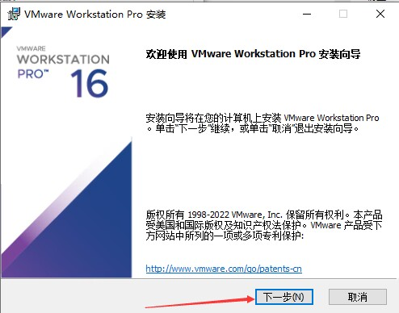
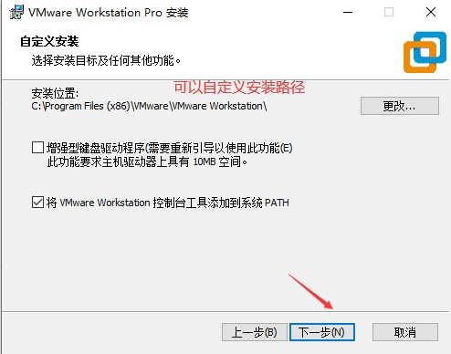
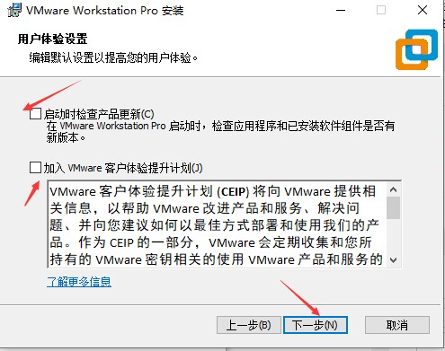
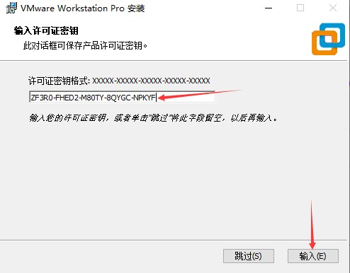
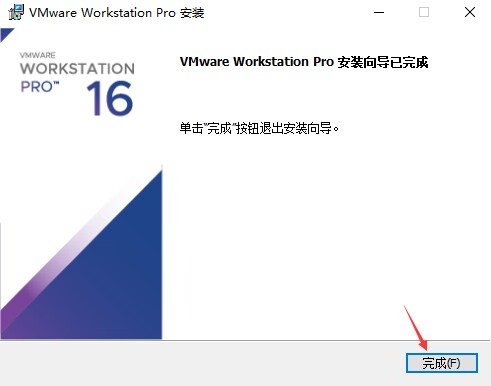
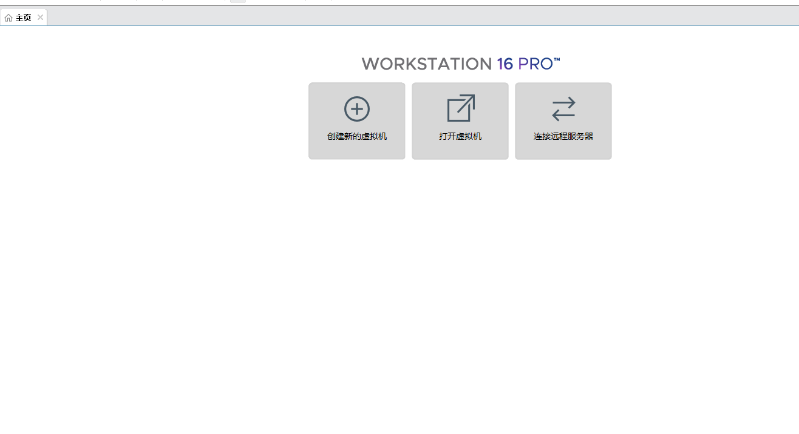

# windows安装VMware16pro

访问vmware官网：[https://www.vmware.com/products/workstation-pro/workstation-pro-evaluation.html](https://www.vmware.com/products/workstation-pro/workstation-pro-evaluation.html)

点击下图红圈中的下载就会自动下载，等就行

<figure><figcaption></figcaption></figure>

打开下载后的文件

<figure><figcaption></figcaption></figure>

<figure><figcaption></figcaption></figure>

<figure><figcaption></figcaption></figure>

<figure><figcaption></figcaption></figure>

<figure><figcaption></figcaption></figure>

<figure><figcaption></figcaption></figure>

<figure><figcaption></figcaption></figure>

输入下图的框框中   ZF3R0-FHED2-M80TY-8QYGC-NPKYF

<figure><figcaption></figcaption></figure>

<figure><figcaption></figcaption></figure>

在桌面打开VMware

<figure><figcaption></figcaption></figure>

到此完成
