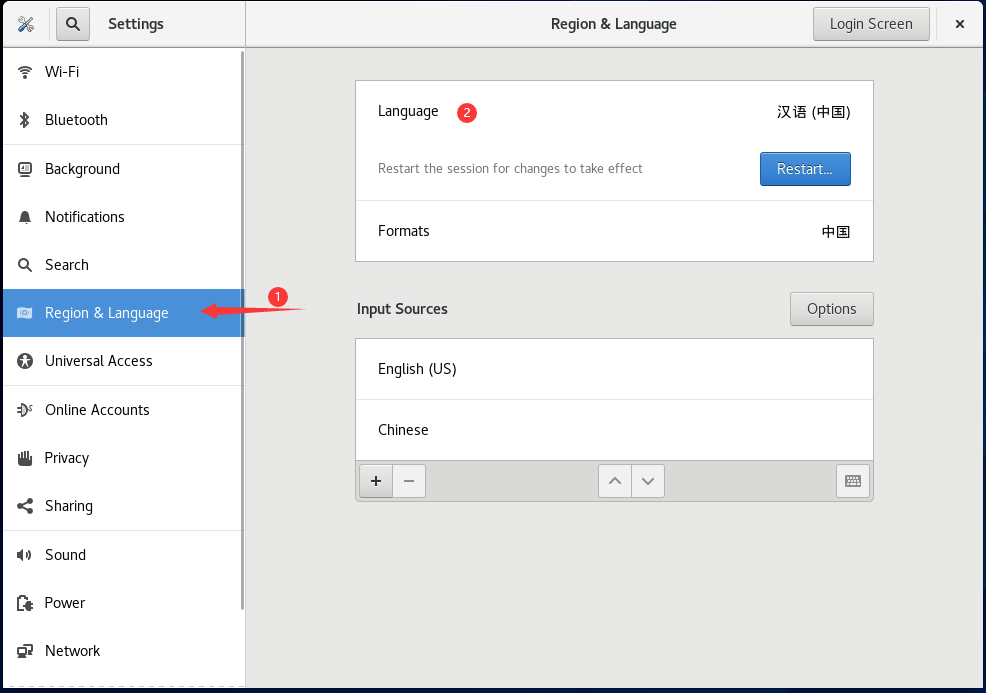

# VMware安装centos8.5

镜像下载地址[https://mirrors.aliyun.com/centos/8/isos/x86\_64/](https://mirrors.aliyun.com/centos/8/isos/x86\_64/)

本文使用的版本是CentOS-8.5.2111-x86\_64-dvd1.iso

<figure><figcaption></figcaption></figure>

打开VMware，如果你没有安装VMware就访问下方内容下载安装

> [VMware安装教程](/qita/VMware.md)

<figure><figcaption></figcaption></figure>

下面的教程中只要完成了图片中的内容后点击下一步就行

<figure><figcaption></figcaption></figure>

<figure><figcaption></figcaption></figure>

<figure><figcaption></figcaption></figure>

<figure><figcaption></figcaption></figure>

<figure><figcaption></figcaption></figure>

<figure><figcaption></figcaption></figure>

<figure><figcaption></figcaption></figure>

这里等很久很久之后会进入下面界面

<figure><figcaption></figcaption></figure>

<figure><figcaption></figcaption></figure>

这里等很久很久之后会重启就一直等着就行，最后会进入下图桌面

<figure><figcaption></figcaption></figure>

<figure><figcaption></figcaption></figure>

<figure><figcaption></figcaption></figure>

<figure><figcaption></figcaption></figure>

<figure><figcaption></figcaption></figure>

<figure><figcaption></figcaption></figure>

点击上图logout后会让重新登录，输入密码登录即可

<figure><figcaption></figcaption></figure>

下图即为安装成功，直接用就行了，网络都是默认配好的，直接就能用

<figure><figcaption></figcaption></figure>
