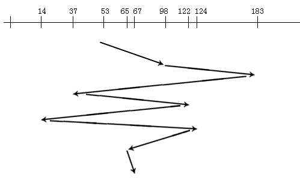
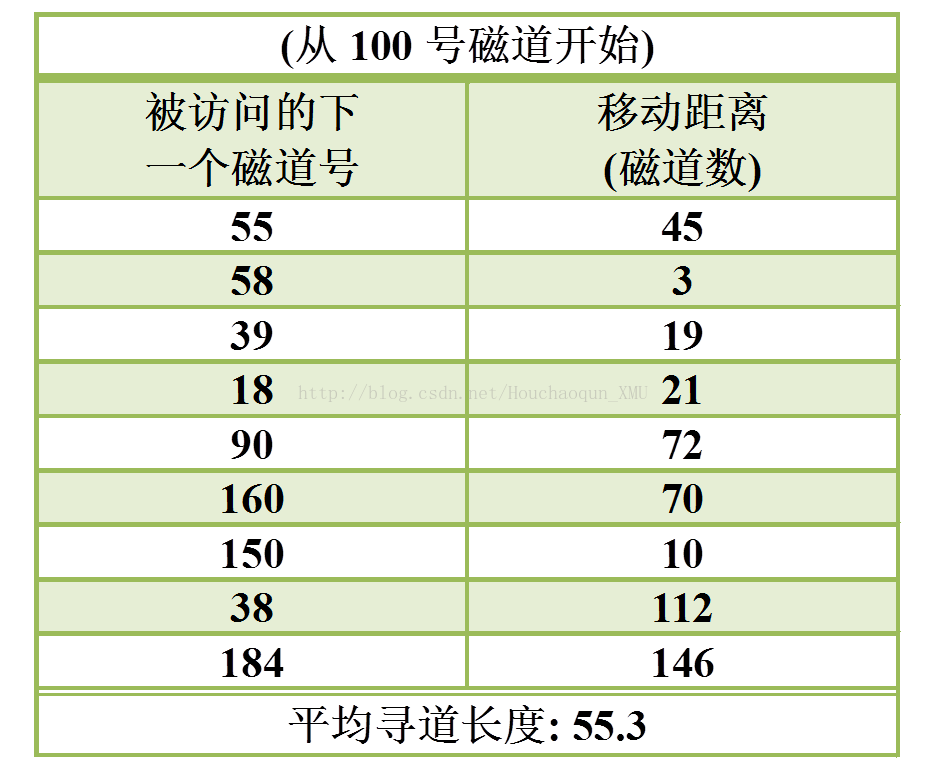
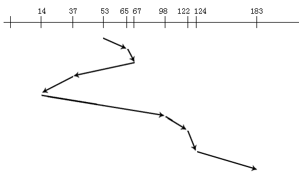
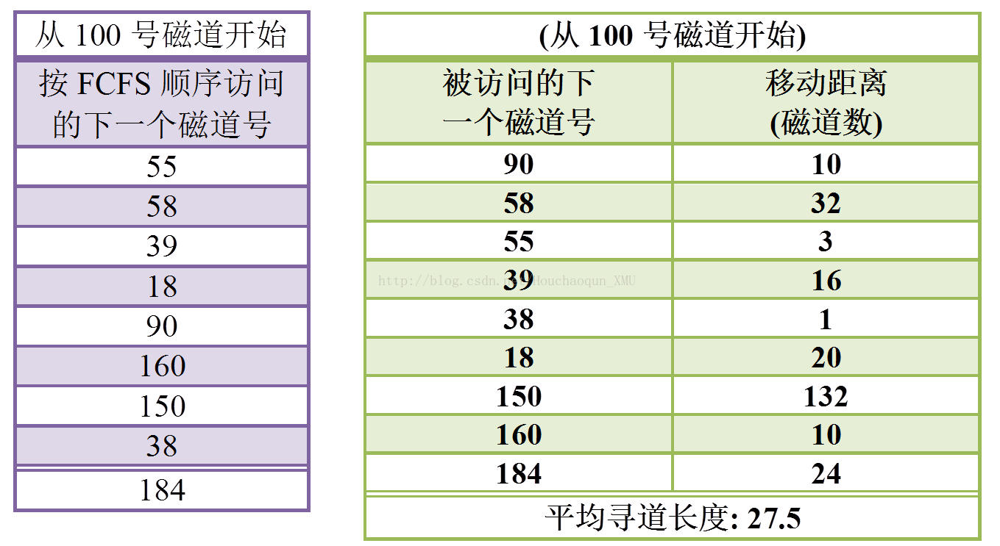
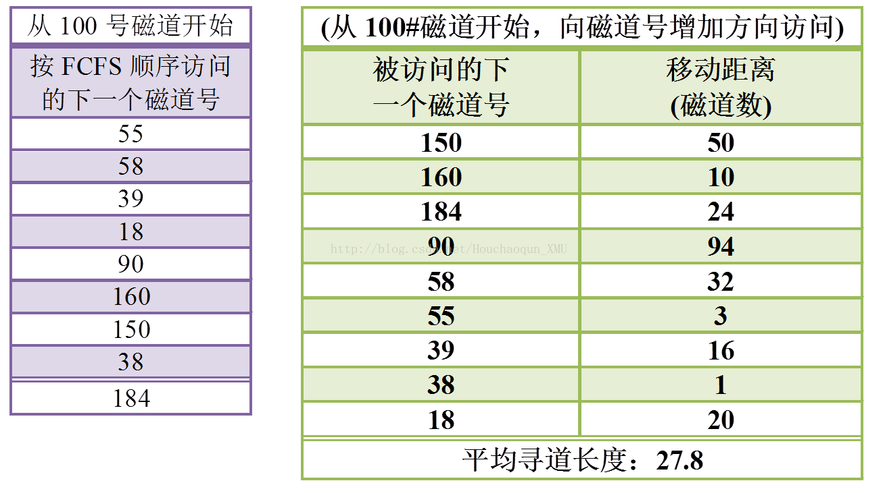
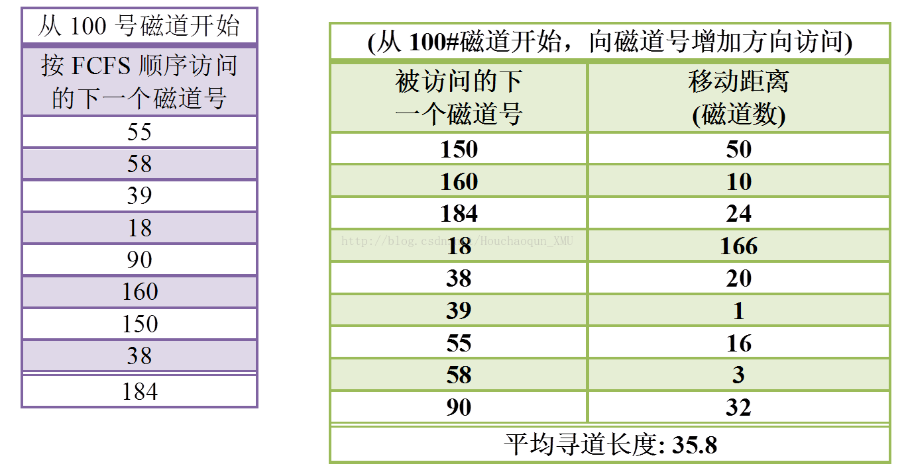

# 磁盘调度算法

## 先来先服务算法(FCFS:first come first served)

FCFS算法根据进程请求访问磁盘的先后顺序进行调度，这是一种最简单的调度算法。该算法的优点是具有公平性。如果只有少量进程需要访问，且大部分请求都是访问簇聚的文件扇区，则有望达到较好的性能；但如果有大量进程竞争使用磁盘，那么这种算法在性能上往往接近于随机调度。所以，实际磁盘调度中考虑一些更为复杂的调度算法。

1、算法思想：按访问请求到达的先后次序服务。

2、优点：简单，公平。

3、缺点：效率不高，相邻两次请求可能会造成最内到最外的柱面寻道，使磁头反复移动，增加了服务时间，对机械也不利。

4、例子：

假设磁盘访问序列：98，183，37，122，14，124，65，67。读写头起始位置：53。求：磁头服务序列和磁头移动总距离（道数）。
由题意和先来先服务算法的思想，得到下图所示的磁头移动轨迹。由此：

磁头服务序列为：98，183，37，122，14，124，65，67

磁头移动总距离=（98-53）+（183-98）+|37-183|+（122-37）+|14-122|+（124-14）+|65-124|+（67-65）=640（磁道）




## 最短寻道时间优先算法(SSTF即shortest seek time first)

SSTF算法选择调度处理的磁道是与当前磁头所在磁道距离最近的磁道，以使每次的寻找时间最短。当然，总是选择最小寻找时间并不能保证平均寻找时间最小，但是能提供比FCFS算法更好的性能。这种算法会产生“饥饿”现象。因为只要不断有新进程的请求到达，且其所要访问的磁道与磁头当前所在磁道的距离较近，这种新进程的I/O请求必然优先满足。对SSTF算法略加修改后所形成的SCAN算法，即可防止老进程出现“饥饿”现象。

1、算法思想：优先选择距当前磁头最近的访问请求进行服务，主要考虑寻道优先。

2、优点：改善了磁盘平均服务时间。

3、缺点：造成某些访问请求长期等待得不到服务。

4、例子：磁头服务序列为：98，183，37，122，14，124，65，67，可得磁头移动的轨迹如下图。




## 扫描算法(SCAN)

该算法不仅考虑到欲访问的磁道与当前磁道间的距离，更优先考虑的是磁头当前的移动方向。例如，当磁头正在自里向外移动时，SCAN算法所考虑的下一个访问对象，应是其欲访问的磁道既在当前磁道之外，又是距离最近的。这样自里向外地访问，直至再无更外的磁道需要访问时，才将磁臂换向为自外向里移动。这时，同样也是每次选择这样的进程来调度，即要访问的磁道在当前位置内距离最近者，这样，磁头又逐步地从外向里移动，直至再无更里面的磁道要访问，从而避免了出现“饥饿”现象。



## 循环扫描算法(CSCAN)

SCAN算法既能获得较好的寻道性能，又能防止“饥饿”现象，故被广泛用于大、中、小型机器和网络中的磁盘调度。
但SCAN也存在这样的问题：当磁头刚从里向外移动而越过了某一磁道时，恰好又有一进程请求访问此磁道，这时，该进程必须等待，待磁头继续从里向外，然后再从外向里扫描完所有要访问的磁道后，才处理该进程的请求，致使该进程的请求被大大地推迟。
为了减少这种延迟，CSCAN算法规定磁头单向移动，例如，只是自里向外移动，当磁头移到最外的磁道并访问后，磁头立即返回到最里的欲访问的磁道，亦即将最小磁道号紧接着最大磁道号构成循环，进行循环扫描。
采用循环扫描方式后，上述请求进程的请求延迟将从原来的2T减为T + Smax，其中，T为由里向外或由外向里单向扫描完要访问的磁道所需的寻道时间，而Smax是将磁头从最外面被访问的磁道直接移到最里面欲访问的磁道(或相反)的寻道时间。图5-28示出了CSCAN算法对9个进程调度的次序及每次磁头移动的距离。



## 比较

|            |  优点 |  缺点   |
| :----------: | :----: | :-----------------: |
|FCFS算法|公平、简单 |平均寻道距离大，仅应用在磁盘I/O较少的场合|
|SSTF算法|性能比“先来先服务”好| 不能保证平均寻道时间最短，可能出现“饥饿”现象|
|SCAN算法|寻道性能较好，可避免“饥饿”现象 |不利于远离磁头一端的访问请求|
|C-SCAN算法| 消除了对两端磁道请求的不公平 |-- |

```cpp
#include <iostream>
#include <fstream>
#include <iomanip>
 
using namespace std;
 
const int MaxNumber=100;
int TrackNum;
int StartTrack;
int TrackOrder[MaxNumber];
int VisitOrder[MaxNumber];
bool isVisited[MaxNumber];
int MoveDistance[MaxNumber];
int totalDistance;
double AverageDistance;
bool direction;
 
void input();
void initial();
int getPositive(int num1,int num2);
void FCFS();
void SSTF();
void SCAN();
void ImprovedSCAN();
void display();
 
void input()
{
	ifstream readData;
	readData.open("data2.txt");
	readData>>TrackNum;  //磁道个数
	for (int i=0;i<TrackNum;i++)
	{
		readData>>TrackOrder[i];   //磁道访问序列
	}
	readData>>StartTrack;  //开始磁道号
	cout<<"文件信息如下："<<endl;
	cout<<"磁道个数TrackNum = "<<TrackNum<<endl;
	cout<<"磁道访问序列：";
	for (int i=0;i<TrackNum;i++)
	{
		cout<<TrackOrder[i]<<" ";
	}
	cout<<endl;
	cout<<"开始磁道号StartTrack = "<<StartTrack<<endl;
	cout<<"****************开始******************"<<endl;
 
}
 
int getPositive(int num1,int num2)
{
	if (num1 - num2>0)
	{
		return (num1 - num2);
	}
	else
		return (num2 - num1);
}
 
void initial()
{
	for (int i=0;i<TrackNum;i++)
	{
		MoveDistance[i] = 0;
		VisitOrder[i] = TrackOrder[i];
		isVisited[i] = false;
	}
	totalDistance = 0;
	AverageDistance = 0;
}
 
void FCFS()
{
	cout<<"******* 你选择了FCFS算法 ***********************************"<<endl;
	initial();
	
	MoveDistance[0] = getPositive(TrackOrder[0],StartTrack);
	totalDistance = MoveDistance[0];
	VisitOrder[0] = TrackOrder[0];
 
	for (int i=1;i<TrackNum;i++)
	{
		MoveDistance[i] = getPositive(TrackOrder[i],TrackOrder[i-1]);
		totalDistance += MoveDistance[i];
 
		VisitOrder[i] = TrackOrder[i];
	}
 
	AverageDistance = totalDistance*1.0/TrackNum;
	display();
 
	cout<<"******* FCFS算法结束     ***********************************"<<endl;
}
 
void SSTF()
{
	cout<<"******* 你选择了SSTF算法 ***********************************"<<endl;
	initial();
	int CurrentTrack = StartTrack;  //
	int i,j,pointMin;
	int disTemp[MaxNumber];
 
 
	for (i = 0;i<TrackNum;i++)
	{
		for (j = 0;j<TrackNum;j++)
		{
			if (!isVisited[j])
			{
				disTemp[j] = getPositive(TrackOrder[j],CurrentTrack);
			}
			else
				disTemp[j] = 10000;  //表示无穷远，即访问过的磁道就不再访问
		}
 
		pointMin = 0;
		for (j = 0;j<TrackNum;j++)
		{
			if (disTemp[pointMin] > disTemp[j])
			{
				pointMin = j;   //指向最小的位置
			}
		}
		VisitOrder[i] = TrackOrder[pointMin];  //给访问序列赋值
		MoveDistance[i] = getPositive(TrackOrder[pointMin],CurrentTrack);  //计算每次的移动距离
		totalDistance += MoveDistance[i];   //累计移动距离
		CurrentTrack = TrackOrder[pointMin];   //改变当前的磁道号
		isVisited[pointMin] = true;  //将当前的磁道号设置为已访问
 
	}
 
	AverageDistance = totalDistance*1.0/(TrackNum);
	display();
	cout<<"******* SSTF算法结束     ***********************************"<<endl;
}
 
void SCAN()
{
	/*
	算法思想：
	1. SCAN算法所考虑的下一个访问对象，应是其欲访问的磁道既在当前磁道之外，又是距离最近的
	   直至再无更外的磁道需要访问时，才将磁臂换向为自外向里移动
	2. 本程序先将磁道序列从小到大进行排序，再进行相应的处理，时间复杂度为取决于排序算法的时间复杂度
	*/
	cout<<"******* 你选择了SCAN算法 ***********************************"<<endl;
	cout<<"******* 请选择头移动方向 *******"<<endl;
	cout<<"******* 0表示向磁道增加的方向访问 *******"<<endl;
	cout<<"******* 1表示向磁道减小的方向访问 *******"<<endl;
	cout<<"direction = ";
	cin>>direction;
 
	initial();
 
	int TrackOrderIndex[MaxNumber],SortTrackOrder[MaxNumber];
	int i,j,temp,tempIndex;
	for (i = 0;i<TrackNum;i++)
	{
		TrackOrderIndex[i] = i;
		SortTrackOrder[i] = TrackOrder[i];
	}
 
	for (i = TrackNum - 1;i>0;i--)
	{
		for (j = 0;j<i;j++)
		{
			if (SortTrackOrder[j]>=SortTrackOrder[j+1])
			{
				//更新排序后的磁道号
				temp = SortTrackOrder[j];
				SortTrackOrder[j] = SortTrackOrder[j+1];
				SortTrackOrder[j+1] = temp;
 
				//更新排序后的磁道号索引值
				tempIndex = TrackOrderIndex[j];
				TrackOrderIndex[j] = TrackOrderIndex[j+1];
				TrackOrderIndex[j+1] = tempIndex;
 
			}//if
		}//for
	}//for   获得排序后的磁道号以及对应的原来的索引值
 
	int point = 0;
	while(StartTrack>=SortTrackOrder[point])
	{
		point++;
	}  //找到当前对应的：既在当前磁道之外，又是距离最近的磁道号索引值point
 
	int count = 0; 
	int currentTrack = StartTrack;
 
	if (direction == 0)  //向磁道增加的方向访问
	{
		cout<<"            向磁道增加的方向访问"<<endl;
		for (i = point;i<TrackNum;i++)
		{
			VisitOrder[count] = SortTrackOrder[i];
			MoveDistance[count] = getPositive(VisitOrder[count],currentTrack);
			currentTrack = VisitOrder[count];
			count++;
		}
 
		for (i = point - 1;i>=0;i--)
		{
			VisitOrder[count] = SortTrackOrder[i];
			MoveDistance[count] = getPositive(VisitOrder[count],currentTrack);
			currentTrack = VisitOrder[count];
			count++;
		}
	}//if
	else if (direction == 1)
	{
		cout<<"            向磁道减小的方向访问"<<endl;
 
		for (i = point - 1;i>=0;i--)
		{
			VisitOrder[count] = SortTrackOrder[i];
			MoveDistance[count] = getPositive(VisitOrder[count],currentTrack);
			currentTrack = VisitOrder[count];
			count++;
		}
 
		for (i = point;i<TrackNum;i++)
		{
			VisitOrder[count] = SortTrackOrder[i];
			MoveDistance[count] = getPositive(VisitOrder[count],currentTrack);
			currentTrack = VisitOrder[count];
			count++;
		}
	}//else
 
	for (i = 0;i<TrackNum;i++)
	{
		totalDistance += MoveDistance[i];
	}
 
	AverageDistance = (totalDistance*1.0)/TrackNum;
 
	display();
 
 
 
	cout<<"******* SCAN算法结束     ***********************************"<<endl;
}
 
void ImprovedSCAN()
{
	cout<<"******* 你选择了ImprovedSCAN算法 ***********************************"<<endl;
	cout<<"******* 请选择头移动方向 *******"<<endl;
	cout<<"******* 0表示向磁道增加的方向访问 *******"<<endl;
	cout<<"******* 1表示向磁道减小的方向访问 *******"<<endl;
	cin>>direction;
 
	initial();
	int TrackOrderIndex[MaxNumber],SortTrackOrder[MaxNumber];
	int i,j,temp,tempIndex;
	for (i = 0;i<TrackNum;i++)
	{
		TrackOrderIndex[i] = i;
		SortTrackOrder[i] = TrackOrder[i];
	}
 
	for (i = TrackNum - 1;i>0;i--)
	{
		for (j = 0;j<i;j++)
		{
			if (SortTrackOrder[j]>=SortTrackOrder[j+1])
			{
				//更新排序后的磁道号
				temp = SortTrackOrder[j];
				SortTrackOrder[j] = SortTrackOrder[j+1];
				SortTrackOrder[j+1] = temp;
 
				//更新排序后的磁道号索引值
				tempIndex = TrackOrderIndex[j];
				TrackOrderIndex[j] = TrackOrderIndex[j+1];
				TrackOrderIndex[j+1] = tempIndex;
 
			}//if
		}//for
	}//for   获得排序后的磁道号以及对应的原来的索引值
 
	int point = 0;
	while(StartTrack>=SortTrackOrder[point])
	{
		point++;
	}  //找到当前对应的：既在当前磁道之外，又是距离最近的磁道号索引值point
 
	int count = 0; 
	int currentTrack = StartTrack;
	if (direction == 0)  //向磁道增加的方向访问
	{
		cout<<"            向磁道增加的方向访问"<<endl;
		for (i = point;i<TrackNum;i++)
		{
			VisitOrder[count] = SortTrackOrder[i];
			MoveDistance[count] = getPositive(VisitOrder[count],currentTrack);
			currentTrack = VisitOrder[count];
			count++;
		}
 
		for (i =0;i<point;i++)
		{
			VisitOrder[count] = SortTrackOrder[i];
			MoveDistance[count] = getPositive(VisitOrder[count],currentTrack);
			currentTrack = VisitOrder[count];
			count++;
		}
	}//if
	else if (direction == 1)
	{
		cout<<"            向磁道减小的方向访问"<<endl;
 
		for (i = 0;i<point;i++)
		{
			VisitOrder[count] = SortTrackOrder[i];
			MoveDistance[count] = getPositive(VisitOrder[count],currentTrack);
			currentTrack = VisitOrder[count];
			count++;
		}
 
		for (i = point;i<TrackNum;i++)
		{
			VisitOrder[count] = SortTrackOrder[i];
			MoveDistance[count] = getPositive(VisitOrder[count],currentTrack);
			currentTrack = VisitOrder[count];
			count++;
		}
	}//else
 
	for (i = 0;i<TrackNum;i++)
	{
		totalDistance += MoveDistance[i];
	}
 
	AverageDistance = (totalDistance*1.0)/TrackNum;
 
	display();
 
	cout<<"******* ImprovedSCAN算法结束     ***********************************"<<endl;
}
 
void display()
{
	cout<<setw(16)<<"从"<<StartTrack<<"号磁道开始"<<setw(4)<<endl;
	cout<<setw(2)<<"被访问的下一个磁道号   "<<setw(6)<<"   移到距离（磁道数）"<<setw(4)<<endl;
	for (int i=0;i<TrackNum;i++)
	{
		cout<<setw(10)<<VisitOrder[i]<<setw(24)<<MoveDistance[i]<<setw(8)<<endl;
	}
	cout<<"平均寻找长度 AverageDistance= "<<AverageDistance<<endl;
}
 
 
 
 
int main()
{
	input();
	int chooseAlgorithm;
	int IsContinue = 1;
	while(IsContinue)
	{
		cout<<"******* 请选择算法 *******"<<endl;
		cout<<"******* 1-FCFS     *******"<<endl;
		cout<<"******* 2-SSTF     *******"<<endl;
		cout<<"******* 3-SCAN     *******"<<endl;
		cout<<"******* 4-循环SCAN *******"<<endl;
		cout<<"chooseAlgorithm = ";
		cin>>chooseAlgorithm;
		
		switch(chooseAlgorithm)
		{
		case 1:
			FCFS();break;
		case 2:
			SSTF();break;
		case 3:
			SCAN();break;
		case 4:
			ImprovedSCAN();break;
		default:
			cout<<"******* 警告：请输入正确的选择！ *******"<<endl;break;
		}
 
		cout<<"******* 是否继续选择算法？ *******"<<endl;
		cout<<"******* 0代表退出 ******* "<<endl;
		cout<<"******* 1代表继续 ******* "<<endl;
		cout<<"IsContinue = ";
		cin>>IsContinue;
 
	}
 
	cout<<"****************结束******************"<<endl;
 
	return 0;
}
```