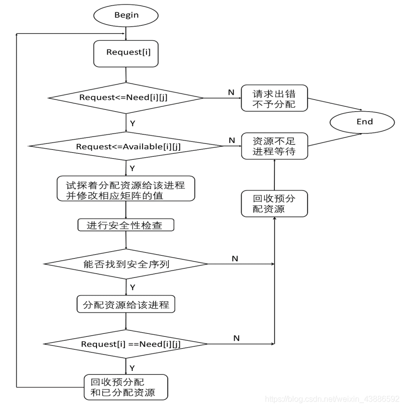
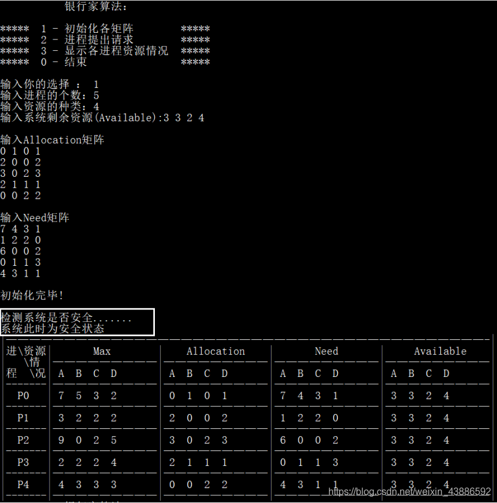
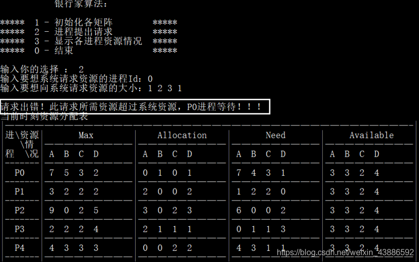
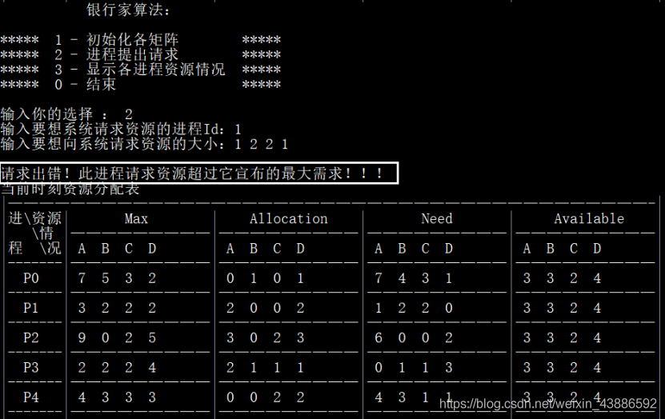
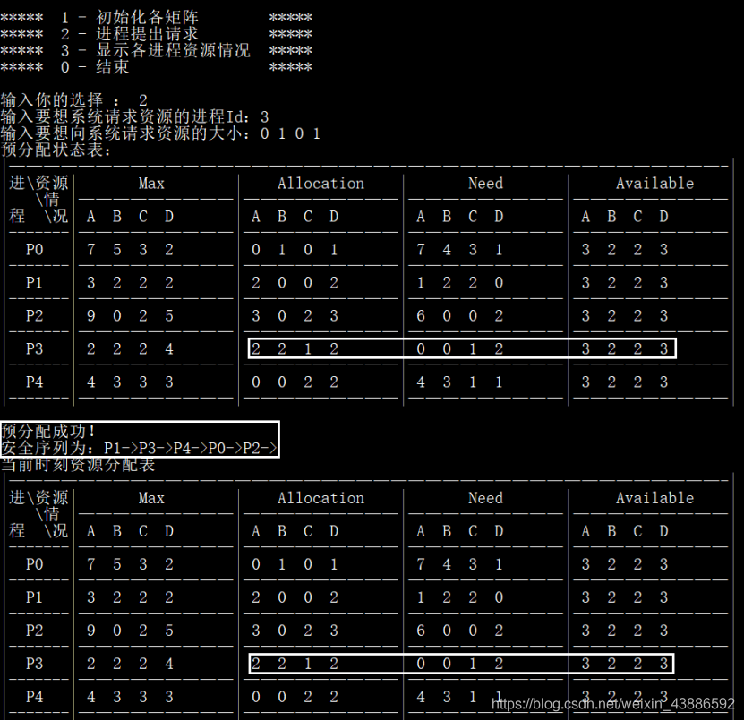
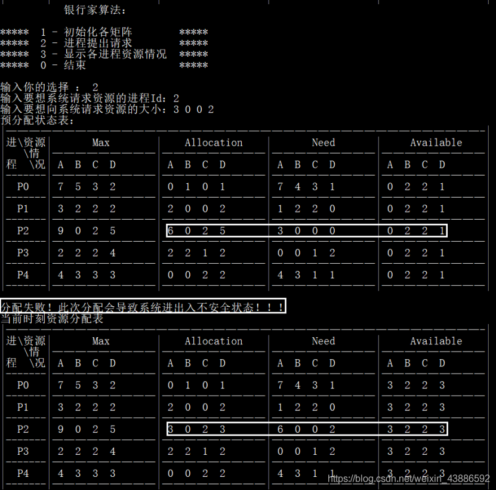
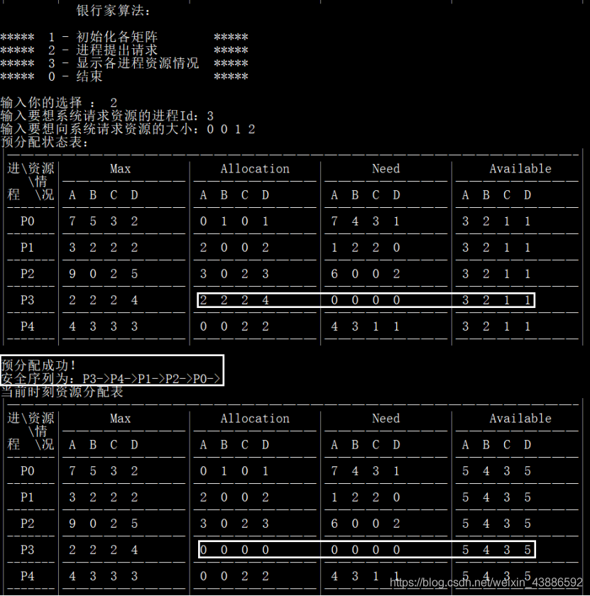

# 银行家算法

## 一、死锁及银行家算法背景介绍

1 .死锁

1.1定义：

指的是多个进程在运行过程中因为争夺资源而造成的种僵局，当进程处于这种僵局状态时，若无外力作用，他们都将无法再向前推进的状态。

1.2 产生死锁的原因：

竞争非可剥夺性资；进程推进不当。

1.3产生死锁的必要条件:

互斥条件；请求和保持条件；不可剥夺条件；环路等待条件。

1.4处理死锁的基本发法:

(1)预防死锁:属于事前预防的策略，通过设置某些限制条件，去破坏产生死锁的四个必要条件或其中的几个条件。预防死锁比较容易实现，所以被泛使用，但是由于施加的限制条件过于严格可能会导致系统资源利用率和系统吞吐量降低。

(2)避免死锁:属于事前预防的策略，但它并不需要事先采取各种限制措施去破坏产生死锁的四个必要条件，而是在资源的动态分配过程中，用某种方法去防止系统进入不安全状态，从而避免死锁的产生。但实现有一定的难度。目前较完善的系统中常用此法来避免死锁。

(3)检测死锁:这种方法不需要事前采取任何限制措施，也不用检查是否进入不安全状态，而是允许系统在运行的过程中发生死锁。但是通过系统所设置的检
测机构.及时的检测出死锁的发生，并精确的测出与死锁有关的进程和资源，然后，采取适当的措施，从系统中将已发生的死锁清楚掉。

(4)解除死锁:这是与检测死锁相配套的一套措施。当检测到系统已经产生死锁时，须将进程从死锁中解放出来。通常用到的实施方法是撤销或挂起些进程，以便收回一些资源，再将这些资源分配给已处于阻塞状态的进程，使之转为就绪状态，以继续运行。死锁的检测和解除措施，有可能使系统获得较好的资源和吞吐量，但在现实上难度也最大。

(5)预防死锁和避免死锁的区别:预防死锁和避免死锁实质上都是通过施加某种相知条件的方法，来预防发生死锁。两者的主要区别:为了预防死锁所施加的限制条件较为严格，这往往会影响到进程的并发执行，而避免死锁所施加的限制条件则较为宽松，有利于进程的并发执行。

2.银行家算法的由来

Dijkstra的银行家算法是操作系统中最有代表性的死锁避免方案，该算法由于能够用于银行系统现金的发放而得名。在银行中，客户申请贷款的数量是有限的，每个客户在第一次申请贷款时要声明完成该项目所需的最大资金量，在满足所有贷款要求时，客户应及时归还。银行家在客户申请的贷款数量不超过自己拥有的最大值时，都应尽量满足客户的需要。在这样的描述中，银行家就好比操作系统，资金就是资源，客户就相当于要申请资源的进程。
操作系统作为裸机上安装的第一层软件， 起着控制和管理计算机内部软硬件资源，合理组织计算机工作流程，提高计算机工作效率，用户和计算机硬件接口的重要作用。因此操作系统即要保证系统资源的合理分配提高系统资源利用率，同时又要避免死锁等不安全状况的出现，如果这些不安全状况出现操作系统还要解决这些问题，让系统回到安全状态。银行家算法就是在这样的背景下应运而生的。

3.银行家算法的作用

银行家算法是一种最有代表性的避免死锁的算法。在避免死锁方法中允许进程动态地申请资源，但系统在进行资源分配之前，应先计算此次分配资源的安全性，若分配不会导致系统进入不安全状态，则分配，否则等待。为实现银行家算法，系统必须设置若干数据结构。要解释银行家算法，必须先解释操作系统安全状态和不安全状态。

安全序列是指一个进程序列{P1，…，Pn}是安全的，即对于每一个进程Pi(1≤i≤n），它以后尚需要的资源量不超过系统当前剩余资源量与所有进程Pj (j < i )当前占有资源量之和。
银行家算法的核心它通过自己特有的算法，在每次奉陪给进程系统资源前，先试探性的“假设”分配资源给进程Pi,再通过安全性算法检测此次分配是否会导致系统进入不安全状态，如果分配后系统依然安全则系统将资源正是分配给进程Pi;如果此次分配导致系统进入不安全状态，则暂不分配资源给进程Pi。通过这种机制，系统可以有效的避免死锁的产生，确保系统时时刻刻都处在安全状态。

## 二、银行家算法的原理及实现过程

1.大概流程：

(1)T0时刻系统通过算法检测当前系统是否安全，即是否可以找到一个安全序列使当前所有进程顺利完成，若找到则称系统安全。并按照序列对各个进程的执行，并执行步骤(2)；若找不到使说明系统不安全，即系统已进入死锁状态，立刻停止进程的执行，通过挂起些进程来让系统重新进入安全态，当系统处于安全状态后转向执行步骤(2)。

(2)当T1时刻有进程对系统提出请求时，系统先先检测当前进程资源请求是否大于此进程最大需求，若大于则不执行；若不大于，再检测当前的资源要求是否大于系统当前可分配数，若大于则不子分配，若不大于则进行步骤(3)。

(3)系统假设将进程Pi要求的资源分配给Pi,通过安全性算法检测将资源分配给进程后系统是否处于安全状态，若处于安全状态则分配资源，若不处于则不予分配。

2.详细设计

2.1银行家算法数据结构

Avaliable(可利用资源向量)。这是一个含有m个元素的数组，每个元素代表一类可利用资源数目,其初值是系统中所配置的该类全部可用资源数目，其数值随该类资源的分配和回收而动态地改变。

Max(最大需求矩阵)。这是一个m*n的矩阵，它定义了系统中n个进程中的每一个进程对n类资源的最大需求。

Allocation(分配矩阵)。这是一个m*n的矩阵，它定义了当前系统的n个进程得到每一类资源的数目。

Request(请求向量)这是一个含有m个元素的向量，它表示进程i对各类资源的需求情况。

Need(需求矩阵)这是一个n*m的矩阵，它定义了当前系统的n个进程要想完成工作，还需要各类资源的数目。因此有以下关系:

```
Need[i,j] = Max[i,j]-Allocation[i,j]
```

2.2安全性算法数据结构:

Work(工作向量)这是一个含有m个元素的向量，表示系统可以提供给进程继续运行所需的各类资源数目，其初值Work=Avaliable。

Finish(结束向量)表示系统是否有足够的资源分配给进程，使之运行完成。开始时Finish[i]=false,当有足够资源分配给进Finish[j]=ture。

2.3银行家算法:

假设进程Pi提出资源请求Request[i] = k

(1)若Request[i]<= Need[i,j]便转向执行步骤 (2) ;否则认为出错。

(2)若Request[i]<= Available[i,j]便转 向执行步骤(3);否则表示系统尚无足够的资源分配，让Pi等待。

(3)系统假设将Pi所要求的资源分配给Pi，并对数据结构做如下修改:

    Avaliable[j] =Available[j] - Request[j]  
 	Allocation[i,j] = Allocation[i,j] - Request[j]  
 	Need[i,j] = Need[i,j]- Request[j]

(4)系统执行安全性算法，检测此次资源分配后，系统是否处于安全状态。若安全才正式将资源分配给进程Pi,以完成本次分配;否则，本次试探分配废，恢复原来的资源分配状态，让Pi等待。

2.4安全性算法:

(1)从进程集合中找到一个能满足一下条件的进程:

	Finish[i] = false;
	Need[i,j] <= Work[j]; 

若找到执行步骤(2)否则执行步骤(3)。

(2)进程Pi获得资源后，可以顺利执行，直至完成，并释放分配给它们的资源，故应执行:

	Work[i] = Work[i] +Allocation[i,j];
	Finish[i] = true; 

转向执行步骤(2);

(3)若所有的进程的Finish[i]=true都满足，则表示系统处于安全状态;否 则系统处于不安全状态。
由此可见，安全性算法实际是银行家算法的一部分，为当前系统找到一个安全序列，却保此刻的系统的分配状态能够保证内存中的进程全部顺利完成。



测试1：初始化各个矩阵，并调用安全性算法判断系统是否处于安全状态

测试结果：系统处于安全状态




测试2：P0发出请求Request0(1,2,3,1),系统按银行家算法检查：

①Request0(1,2,3,1) <= Need0(7,4,3,1);

②Request0(1,2,3,1) > Available(3,3,2,4);让P0等待！

测试结果:分配出错！此进程请求资源超过系统资源，P0进程等待！！！




测试3：P1发出请求Request1(1,2,2,1),系统按银行家算法检查：

①Request1(1,2,2,1) > Need1(1,2,2,0);

测试结果:分配出错！此进程请求资源超过它宣布的最大需求！！！



测试4：P3发出请求Request3(0,1,0,1),系统按银行家算法检查：(有安全序列但不能回收)

①Request3(0,1,0,1) <= Need3(0,1,1,3);

②Request3(0,1,0,1) <= Available(3,3,2,4);

③资源预分配给此进程

调用安全性算法：

测试结果：安全序列：P1->P3->P4->P0->P2->

此时,预分配成功，但是不能回收p3进程的资源,因为Request3 < Need3



测试5：P2发出请求Request2(3,0,0,2),系统按银行家算法检查：(若分配会形成死锁)

①Request1(3,0,0,2) <= Need3(6,0,0,2);

②Request1(3,0,0,2) <= Available(3,2,2,3);

③资源预分配给此进程

经过系统检查,可用资源Available(0,2,2,1)已不能满足任何进程的需要,故系统若分配此请求会进入不安全状态,所以,此时不分配,本次试探分配作废,恢复原来的资源状态分配。

测试结果：预分配失败！若分配会导致系统进入不安全序列.



测试6：P3发出请求Request3(0,0,1,2),系统按银行家算法检查：(有安全序列且能回收)

①Request3(0,0,1,2) <= Need3(0,1,1,3);

②Request3(0,0,1,2) <= Available(3,3,2,4);
③资源预分配给此进程

经过安全性算法检查，预分配不会导致系统进入不安全状态，可以分配，并且可以回收p3进程的资源,因为Request3 == Need3。

测试结果：预分配成功！



## 代码
Banker.h
```cpp
#pragma once
#define _CRT_SECURE_NO_WARNINGS 1
#include<iostream>
#include<vector>
#include<map>
#include<algorithm>
#include<cstdio>
#include<cstdlib>
using namespace std;

enum Status//系统可能出现的状态
{
	NEED_REQUEST = 0,//所需资源超过此进程宣布的最大值
	AVAILABLE_REQUEST,//所需资源超过此系统当前资源
	SECURITY,//安全状态
	UNSECURITY,//不安全状态
	SUCCESS,//分配成功
	FAIL//分配失败
};

void Init();//初始化
void Display();//显示各个进程资源情况
void Dis_char(int i, char ch);//将ch字符显示i次
bool operator <= (vector<int>& Request, vector<int>& Need);//比较是否Request都小于等于Need
bool operator ==(vector<int>& Need,int n);//Need的每一项都等于0
void Display_Security(pair<vector<int>, Status>& val);//显示安全序列
void Display_Security2(pair<vector<int>, Status>& val);//显示各个进程安全情况
void Require();//进程请求资源
pair<vector<int>, Status> AlgoBanker(int Pid, vector<int>& Requset);//银行家算法
pair<vector<int>, Status> AlgoSecurity();//安全性算法
```
Banker.cpp
```cpp
#include"Banker.h"

#define MAX_SOURCE 6 //可打印的最大资源数

#define STATE 4 //表格中的四列
vector<vector<int>> Allocation;//系统给此进程已分配资源
vector<vector<int>> Need;//此进程还需分配资源
vector<vector<int>> Max;//此进程需要最大资源
vector<int> Available;//系统可用资源

void Dis_char(int i, char ch)
{
	while (i--)
	{
		cout << ch;
	}
}

void Display()
{
	char Name[] = "ABCDEFGH";
	int n = Need.size();//进程数
	int m = Need[0].size();//资源数
	int i, j, tmp;

	//1.打印表头
	printf("|—————————————————————————————————————————-|\n");
	printf("%-8s%-19s%-19s%-19s%-20s", "|进\\资源", "|       Max        ", "|    Allocation    ", "|       Need       ", "|     Available    |\n");
	printf("|   \\情 |—————————|—————————|—————————|—————————|\n");
	printf("|程  \\况");
	for (i = 0; i < STATE; i++)
	{
		cout << "|";
		for (j = 0; j < m; j++)
		{
			printf(" %c ", Name[j]);
		}
		tmp = MAX_SOURCE - m;//超出的用空格弥补
		Dis_char(tmp * 3, ' ');
	}
	cout << "|\n";
	printf("|-------|—————————|—————————|—————————|—————————|\n");


	//2.打印每一行
	for (i = 0; i < n; i++)
	{
		printf("|  P%-2d  ", i);
		for (j = 0; j < m; j++)//Max数据
		{
			cout << "|";
			for (j = 0; j < m; j++)
			{
				printf(" %d ", Max[i][j]);
			}
			tmp = MAX_SOURCE - m;//超出的用空格弥补
			Dis_char(tmp * 3, ' ');
		}


		for (j = 0; j < m; j++)//Allcoation数据
		{
			cout << "|";
			for (j = 0; j < m; j++)
			{
				printf(" %d ", Allocation[i][j]);
			}
			tmp = MAX_SOURCE - m;//超出的用空格弥补
			Dis_char(tmp * 3, ' ');
		}

		for (j = 0; j < m; j++)//Need数据
		{
			cout << "|";
			for (j = 0; j < m; j++)
			{
				printf(" %d ", Need[i][j]);
			}
			tmp = MAX_SOURCE - m;//超出的用空格弥补
			Dis_char(tmp * 3, ' ');
		}


		cout << "|";
		for (j = 0; j < m; j++)//Available数据
		{
			printf(" %d ", Available[j]);
		}

		tmp = MAX_SOURCE - m;//超出的用空格弥补
		Dis_char(tmp * 3, ' ');

		cout << "|\n";
		printf("|-------|—————————|—————————|—————————|—————————|\n");
	}
}

bool operator <= (vector<int>& Request, vector<int>& Need)//比较是否Request都小于等于Need
{
	for (int i = 0; i < Request.size(); i++)
	{
		if (Request[i] > Need[i])
		{
			return false;
		}
	}
	return true;
}

bool operator ==(vector<int>& Need,int n)//Need的每一项都等于0,
{
	for (auto& e : Need)
	{
		if (e != n)
		{
			return false;
		}
	}
	return true;
}


void Display_Security(pair<vector<int>, Status>& tmp)//显示是否安全
{
	if (tmp.second == SUCCESS)
	{
		cout << "安全序列为：";
		for (auto& e : tmp.first)
		{
			cout << "P" << e << "->";
		}
		cout << endl;

	}
	else
	{
		if (tmp.first.size() > 0)
		{
			for (auto& e : tmp.first)
			{
				cout << "P" << e << "->";
			}
			cout << "找到P" << tmp.first[tmp.first.size() - 1] << "进程后再找不到安全序列！\n";
		}
	}
}
void Init()
{
	pair<vector<int>, Status> retval;
	int PcbNum, Source;
	int i, j, tmp;
	cout << "输入进程的个数：";
	cin >> PcbNum;
	cout << "输入资源的种类：";
	cin >> Source;

	cout << "输入系统剩余资源(Available):";
	for (i = 0; i < Source; i++)
	{
		cin >> tmp;
		Available.push_back(tmp);
	}
	cout << endl;

	cout << "输入Allocation矩阵" << endl;

	for (i = 0; i < PcbNum; i++)
	{
		Allocation.push_back(vector<int>());
		Max.push_back(vector<int>());

		for (j = 0; j < Source; j++)
		{
			cin >> tmp;
			Allocation[i].push_back(tmp);
			Max[i].push_back(tmp);
		}
	}
	cout << endl;

	cout << "输入Need矩阵" << endl;

	for (i = 0; i < PcbNum; i++)
	{
		Need.push_back(vector<int>());

		for (j = 0; j < Source; j++)
		{
			cin >> tmp;
			Need[i].push_back(tmp);
			Max[i][j] += tmp;
		}
	}
	cout << "\n初始化完毕!\n\n";
	cout << "检测系统是否安全.......\n";
	retval = AlgoSecurity();
	if (retval.second == SECURITY)
	{
		cout << "系统此时为安全状态\n";
		Display();
	}

	else
	{
		cout << "系统此时处于不安全状态，请检查你的数据是否合理\n";
	}

}

void Require()//进程请求资源
{
	int Pid, tmp;
	vector<int>Requset;
	pair<vector<int>, Status> retval;

	cout << "输入要想系统请求资源的进程Id：";
	cin >> Pid;

	cout << "输入要想向系统请求资源的大小：";
	for (int i = 0; i < Available.size(); i++)
	{
		cin >> tmp;
		Requset.push_back(tmp);
	}

	retval = AlgoBanker(Pid, Requset);

	switch (retval.second)
	{
	case NEED_REQUEST:cout << "\n请求出错！此进程请求资源超过它宣布的最大需求！！！\n"; cout << "当前时刻资源分配表\n"; Display(); break;
	case AVAILABLE_REQUEST:cout << "\n请求出错！此请求所需资源超过系统资源，P" << Pid << "进程等待！！！\n"; cout << "当前时刻资源分配表\n"; Display(); ; break;
	case SUCCESS:cout << "\n预分配成功！\n"; Display_Security(retval); cout << "当前时刻资源分配表\n"; Display(); break;
	case FAIL:cout << "\n分配失败！此次分配会导致系统进出入不安全状态！！！\n"; Display_Security(retval); cout << "当前时刻资源分配表\n"; Display(); break;
	}
}


pair<vector<int>, Status> AlgoBanker(int Pid, vector<int>& Requset)//银行家算法,传入进程Id和请求分配大小
{
	pair<vector<int>, Status> retval;//first---安全序列，second---分配状态

	if (!(Requset <= Need[Pid]))//请求大于所需大小
	{
		retval.second = NEED_REQUEST;
	}

	else if (!(Requset <= Available))//请求大于系统拥有资源
	{
		retval.second = AVAILABLE_REQUEST;
	}

	else
	{
		for (int i = 0; i < Available.size(); i++)//试着分配给他
		{
			Available[i] -= Requset[i];
			Allocation[Pid][i] += Requset[i];
			Need[Pid][i] -= Requset[i];
		}
		cout << "预分配状态表：\n";
		Display();
		retval = AlgoSecurity();

		if (retval.second == SECURITY)//若处于安全状态
		{
			if (Need[Pid] == 0)//不再需求资源，回收
			{
				for (int i = 0; i < Available.size(); i++)
				{
					Available[i] += Allocation[Pid][i];
					Allocation[Pid][i] = 0;
				}
			}
			else//这次请求后还未完成(Need[Pid]!=0)，不能回收
			{
				//do nothing
			}
			retval.second = SUCCESS;//分配成功
		}
		else//不是安全状态，本次分配作废，回复原来状态。此进程等待
		{
			for (int i = 0; i < Available.size(); i++)
			{
				Available[i] += Requset[i];
				Allocation[Pid][i] -= Requset[i];
				Need[Pid][i] += Requset[i];
			}
			retval.second = FAIL;
		}
	}
	return retval;
}

pair<vector<int>, Status> AlgoSecurity()//安全性算法
{
	pair<vector<int>, Status> retval;//first---安全序列，second---分配状态

	//①初始化两个向量
	vector<int> Work(Available);//工作向量
	vector<bool> Finish(Need.size(), false);//可分配标志
	int i, j;
	int flag;//每找到一个进程满足安全状态，flag--，减到0说明系统出于安全状态
	int tag;

	//②,查找
	while (1)
	{
		flag = count(Finish.begin(), Finish.end(), false);//flag记录暂时不能分配的进程个数
		tag = flag;//记录flag大小

		for (i = 0; i < Need.size(); i++)
		{
			if (Need[i] <= Work && Finish[i] == false)//找到一个进程满足分配需求且状态是未分配
			{
				//③
				for (j = 0; j < Work.size(); j++)
				{
					Work[j] += Allocation[i][j];
				}
				Finish[i] = true;
				flag--;
				retval.first.push_back(i);//将进程id  push 进安全序列中
			}
		}

		//④ ，所有进程Finish==true,表示系统安全
		if (flag == 0)
		{
			retval.second = SECURITY;
			break;
		}

		//进入死锁，不安全
		if (tag == flag)
		{
			retval.second = UNSECURITY;
			break;
		}

		else //循环查找
		{
			//do nothing
		}

	}
	return retval;
}
```

Main .cpp
```cpp
 #include"Banker.h"
int main()
{
    int choose;
    while (1)
	{
		cout << "           银行家算法：" << endl<<endl;
		cout << "*****  1 - 初始化各矩阵        *****" << endl;
		cout << "*****  2 - 进程提出请求        *****" << endl;
		cout << "*****  3 - 显示各进程资源情况  *****" << endl;
		cout << "*****  0 - 结束                *****" << endl << endl;
		cout << "输入你的选择 ： ";
		cin >> choose;
		switch (choose)
		{
		case 0:exit(0); break;
		case 1:Init(); break;
		case 2:Require(); break;
		case 3:Display(); break;
		default:cout << "请输入正确的序号：" << endl;
		}
	}
    system("pause");
    return 0;
}
```