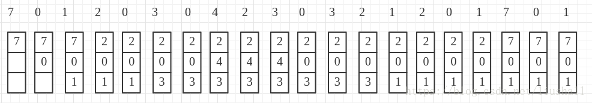
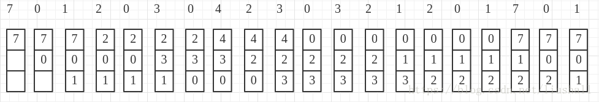
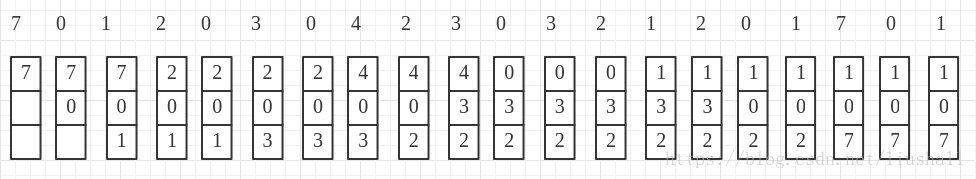

# 页面置换算法

在进程运行过程中，若需要访问的物理块不在内存中，就需要通过一定的方式来将页面载入内存，而此时内存很可能已无空闲空间，因此就需要一定的算法来选择内存中要被置换的页面，这种算法就被称为页面置换算法。页面置换算法的好坏，将直接影响系统的性能。

一个好的页面置换算法，应做到减少页面置换的频率。尽量将以后不会用到的或较长时间不会使用的页面给置换出。

## 最佳置换(OPT)算法

该算法是一种理想化的算法，具有非常好的性能，但是由于目前无法预知未来，因此难以实现。

该算法选择淘汰的页面是：未来永远不会再使用的页面 or 未来最长时间不再被访问的页面。该算法保证了可以获得最低缺页率，但无法预知未来页面的使用情况，因此目前无法实现，但通常用来评价其他算法。

例：假定系统为某进程分配了三个物理块,并考虑有以下的页面号引用串:
7,0,1,2,0,3,0,4,2,3,0,3,2,1,2,0,1,7,0,1
进程运行时,先将 7,0,1 三个页面装入内存。以后,当进程要访问页面 2 时,将会产生缺页中断。此时 OS 根据最佳置换算法,将选择页面 7 予以淘汰。这是因为页面 0 将作为第 5 个被访问的页面,页面 1 是第 14 个被访问的页面,而页面 7 则要在第 18 次页面访问时才需调入。下次访问页面 0 时,因它已在内存而不必产生缺页中断。当进程访问页面 3时,又将引起页面 1 被淘汰;因为,它在现有的 1,2,0 三个页面中,将是以后最晚才被访问的。图 4-26 示出了采用最佳置换算法时的置换图。由图可看出,采用最佳置换算法发生了 6 次页面置换。



## 先进先出（FIFO）页面置换算法

该算法总是淘汰最先进入内存的页面,即选择在内存中驻留时间最久的页面予以淘汰。

例：同上。当进程第一次访问页面 2 时,将把第 7 页换出,因为它是最先被调入内存的;在第一次访问页面 3 时,又将把第 0 页换出, 因为它在现有的 2, 0, 1 三个页面中是最老的页。 由图 4-27 可以看出,利用 FIFO 算法时进行了 12 次页面置换,比最佳置换算法正好多一倍。



## 最近最久未使用(LRU)算法

该算法以过去预测未来，选择之前最长时间未使用的页面置换。但是由于利用“过去”作为“未来”的近似这一做法并非完全可靠，因此有时会造成缺页率非常高，导致效率会非常低。

例：同上。当进程第一次对页面 2 进行访问时,由于页面 7 是最近最久未被访问的,故将它置换出去。当进程第一次对页面 3进行访问时,第 1 页成为最近最久未使用的页,将它换出。由图可以看出,前 5 个时间的图像与最佳置换算法时的相同,但这并非是必然的结果。因为,最佳置换算法是从“向后看”的观点出发的,即它是依据以后各页的使用情况;而 LRU 算法则“向前看”的,即根据各页以前的使用情况来判断,而页面过去和未来的走向之间并无必然的联系。



```cpp
/*************************************************************************
        > 测试数据
        > 20
        > 7 0 1 2 0 3 0 4 2 3 0 3 2 1 2 0 1 7 0 1
        > 3
 ************************************************************************/

#include <iostream>
#include <algorithm>
#include <vector>
#include <map>
using namespace std;

class PageReplacement {
private:
    vector<int> page;
    int page_num;  //物理内存块数
public:
    PageReplacement() : page_num(0) {}
    void create();
    void print();
    void physical_block_print( const vector<int>& );
    bool isfind( const vector<int>&, int );  //查找是否已在内存物理块中
    void FIFO();  //FIFO页面置换算法
    void LRU();  //LRU页面置换算法
    void OPT(); //OPT页面置换算法
};

void PageReplacement::create() {
    cout << "请输入页面个数: ";
    int n, t;
    cin >> n;

    cout << "请输入页面串：\n";
    while( n-- ) {
        cin >> t;
        page.push_back( t );
    }

    cout << "请输入内存物理块数: ";
    cin >> page_num;
}

void PageReplacement::print() {
    int n = page.size();
    cout << "页面串:\n";
    for( int i = 0; i < n; i++ ) {
        cout << page[i] << ' ';
    }
    cout << endl;
}

void PageReplacement::physical_block_print( const vector<int>& t ) {
    int n = t.size();
    for( int i = 0; i < n; i++ ) {
        cout << t[i] << ' ';
    }
    cout << endl;
}

bool PageReplacement::isfind( const vector<int> & block, int t ) {
    if ( find( block.begin(), block.end(), t ) != block.end() ) {
        return true;
    }
    return false;
}

/* FIFO页面置换算法 */
void PageReplacement::FIFO() {
    vector<int> physical_block( page_num, -1 );

    int n = page.size(), cur = 0;
    int not_found = 0;
    cout << "FIFO页面置换情况:\n";
    for( int i = 0; i < n; i++ ) {
        if( !isfind( physical_block, page[i] ) ) {
            physical_block[cur] = page[i];  //页面置换
            cur = (cur+1)%page_num;
            not_found++;
        }
        physical_block_print( physical_block );  //输出每个物理块信息
    }

    cout << "缺页次数："<< not_found << endl;
}

/* LRU页面置换算法 */
void PageReplacement::LRU() {
    vector<int> physical_block( page_num, -1 );
    map<int, int> page_time;
    int n = page.size();
    int not_found = 0;

    for( int i = 0; i < n; i++ ) {
        if ( !isfind( physical_block, page[i] ) ) {  //当前页不在为物理块中
            if ( page_time.size() < page_num ) { //物理块未放满
                physical_block[i] = page[i];
                page_time[page[i]] = i;
            } else {  //物理块放满，进行页面置换
                map<int, int>::iterator it = page_time.begin(), t = it;
                for( it++; it != page_time.end(); it++ ) {
                    if ( t->second > it->second ) {
                        t = it;
                    }
                }
                int index;
                for( index = 0; index < page_num && physical_block[index]!=t->first; index++ )
                    ;
                physical_block[index] = page[i];
                page_time.erase( t );
                page_time[page[i]] = i;
            }
            not_found++;
        } else {  //在物理块中，更新页面最后使用时间
            page_time[page[i]] = i;
        }
        physical_block_print( physical_block );
    }

    cout << "缺页次数："<< not_found << endl;
}

/* OPT页面置换算法 */
void PageReplacement::OPT() {
    vector<int> physical_block( page_num, -1 );
    int n = page.size();
    int not_found = 0;

    for( int i = 0; i < n; i++ ) {
        if( !isfind( physical_block, page[i] ) ) {  //当前页不在物理块中
            if( i < page_num ) {  //物理块未放满
                physical_block[i] = page[i];
            } else {  //物理块放满,进行页面置换
                map<int, int> page_time;
                int k, j;

                /* 获取物理块中页面此后的最先使用时间 */
                for( j = 0; j < page_num; j++ ) { //遍历physical_block
                    for( k = i+1; k < n; k++ ) {  //遍历page
                        if( physical_block[j] == page[k] ) {
                            page_time[page[k]] = k;
                            break;
                        }
                    }
                    if( k == n ) {
                        page_time[physical_block[j]] = k;
                    }
                }

                /* 寻找可以置换的页面 */
                map<int, int>::iterator it = page_time.begin(), t = it;
                for( ; it != page_time.end(); it++ ) {
                    if ( t->second < it->second ) {
                        t = it;
                    }
                }

                /* 获取被置换页面在物理块的下标 */
                int index = 0;
                for( ; index < page_num && physical_block[index] != t->first; index++ )
                    ;
                physical_block[index] = page[i];
            }
            not_found++;
        }
        physical_block_print( physical_block );
    }

    cout << "缺页次数："<< not_found << endl;
}

int main() {
    PageReplacement t;
    t.create();
    // t.FIFO();
    t.LRU();
    // t.OPT();

    return 0;
}
```