# VMware安装Ubuntu22.04.1

点击下面链接进入官网并下载

https://cn.ubuntu.com/download/desktop

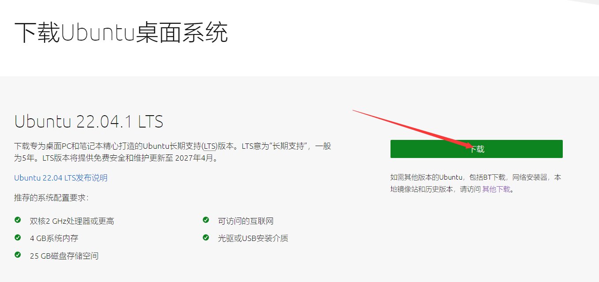

本文使用的版本是ubuntu-22.04.1-desktop-amd64

打开VMware，如果你没有安装VMware就访问下方内容下载安装

> [VMware安装教程](VMware.md)

下面的教程中只要完成了图片中的内容后点击下一步就行

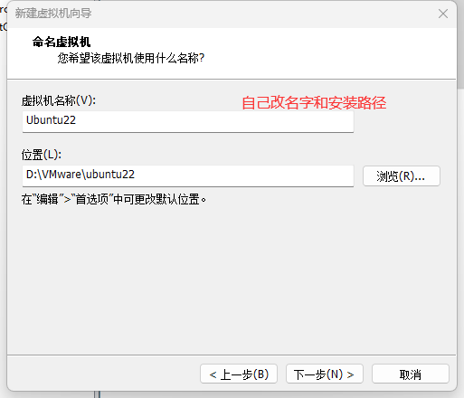

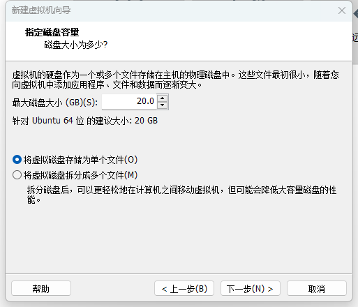

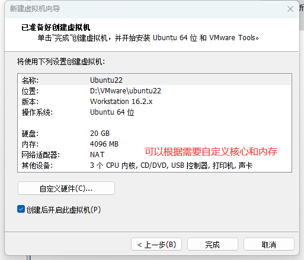

开启虚拟机后等很久很久之后会进入下面界面

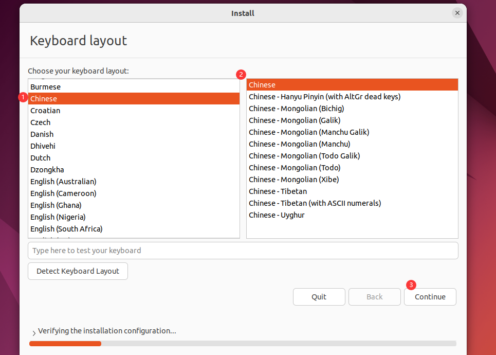

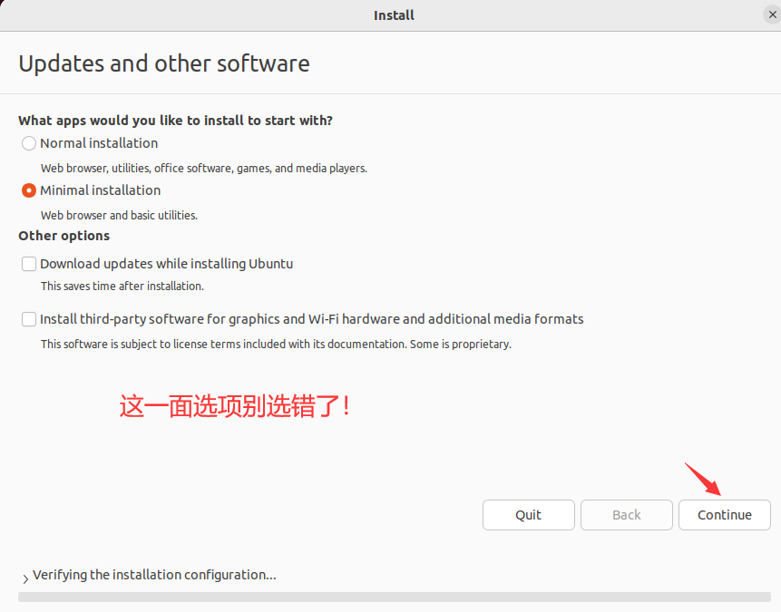

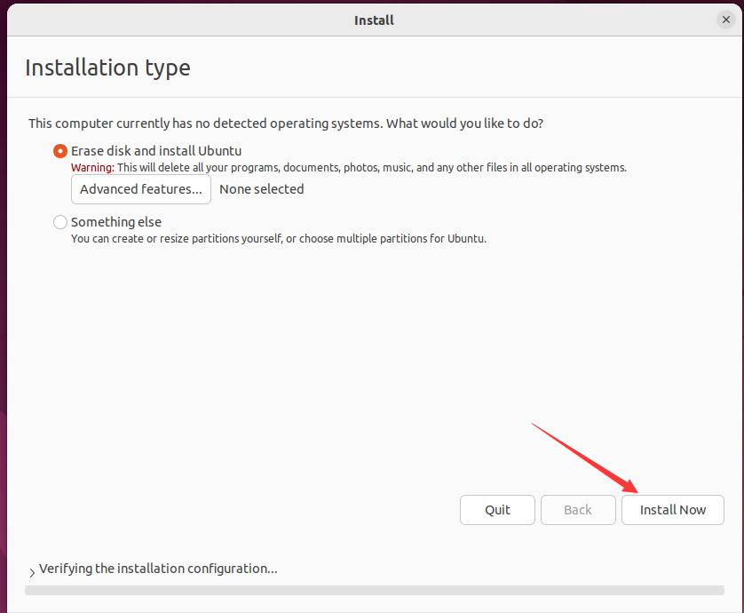

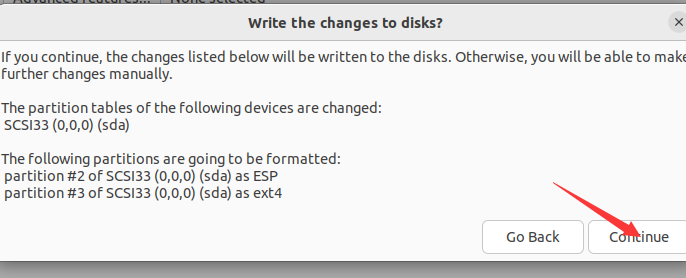

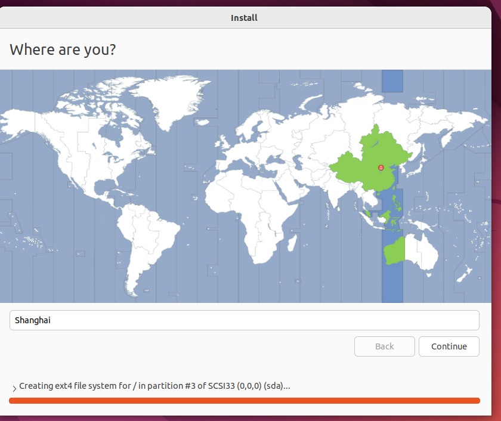

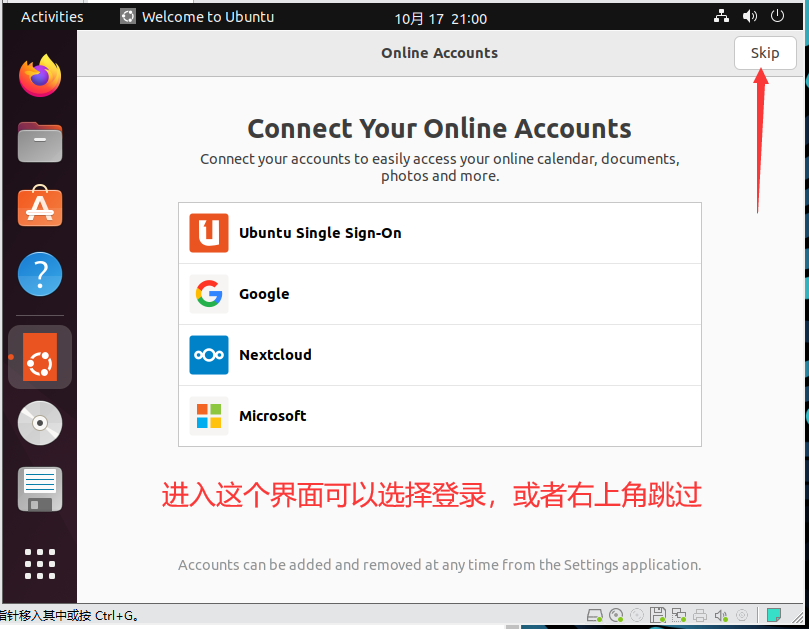

如果你在上图点慢了就可能会出现下图界面，这是个更新界面，可以选择更新（install now）

或者直接×掉（更新要很久很久。。。。。还要重启一次）

不论是否更新都会进入下面的界面

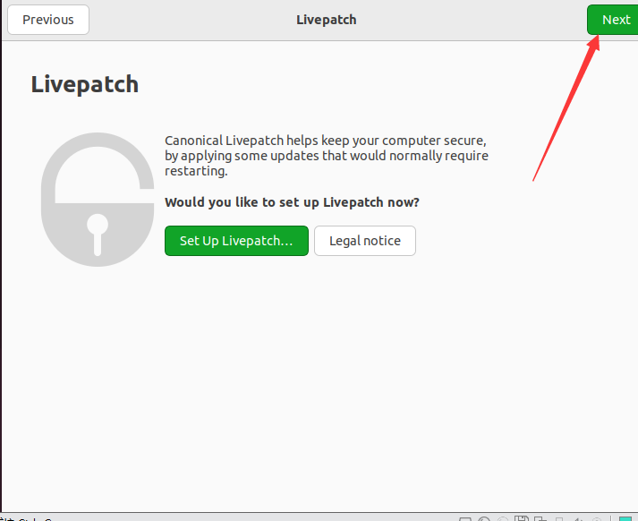

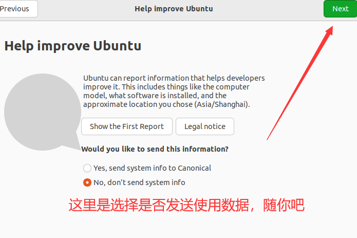

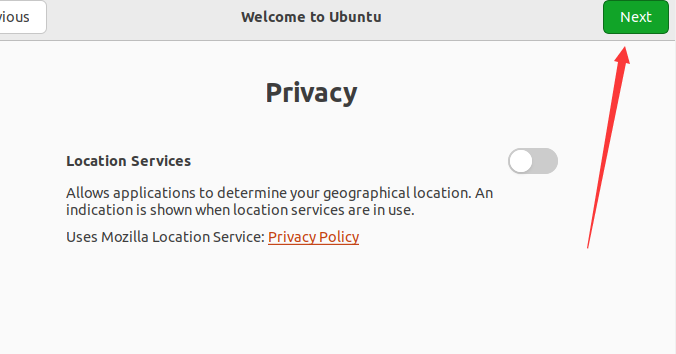

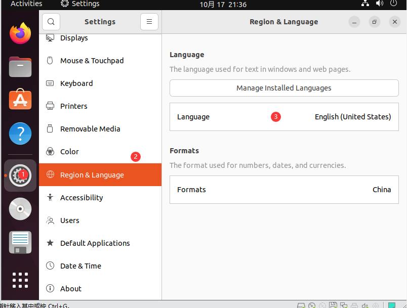

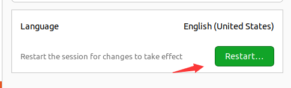

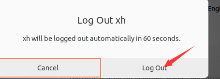

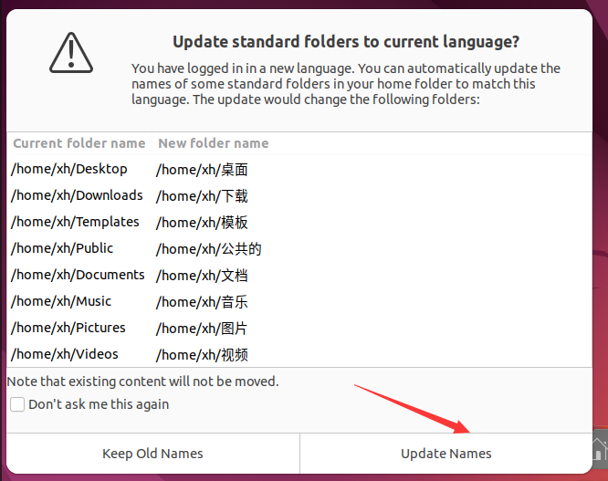

注意：即使这样可能也会导致很多内容不是中文（如果你全是中文就可以不继续看了，当然多看无害）

实测一种方法可以更新较全的中文翻译

如下图所示软件打开（只要图标正确就行，我这是翻译过的）

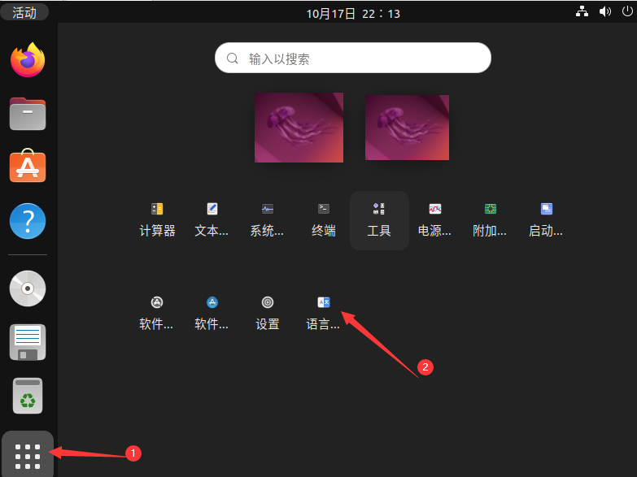

打开这个软件后会自动检测，等待它检测完成后选择更新或安装之类的即可

最后建议重新登录后再重启一下即可，然后就ok了，其他什么的也都是自动配置过的
