# docsify配置教程

docsify介绍：一个神奇的文档站点生成器。

Docsify即时生成您的文档网站。与 GitBook 不同，它不会生成静态 html 文件。相反，它会智能地加载和解析 Markdown 文件，并将它们显示为网站。

没有静态构建的 html 文件；
简单轻便；
智能全文搜索插件；
各种各样的插件接口；
支持表情符号；
支持服务器端渲染

## windows系统安装

> 环境配置

访问node的官网链接：https://nodejs.org/en/

点击下图红箭头所指下载lts版本，注意是lts版本的，不要下最新的（可能不稳定）

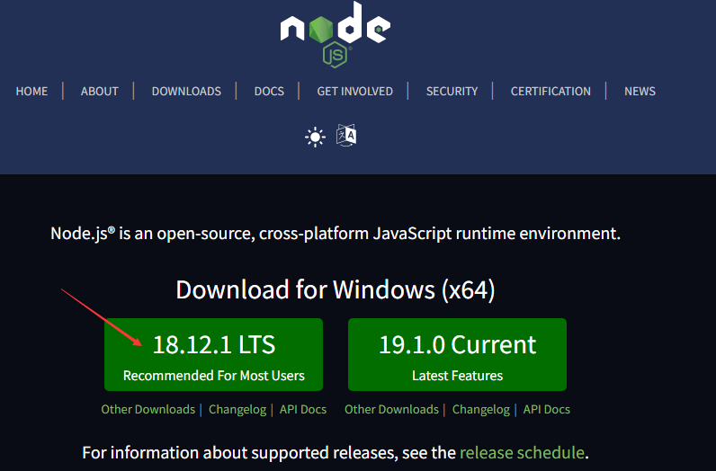

下载完成后打开安装，就一直next就行了，该同意的都同意，安装路径随你改不改都行，最后install

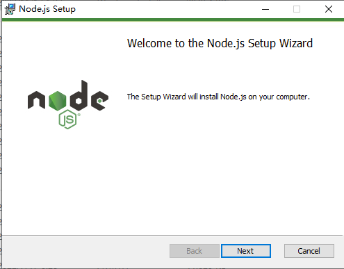
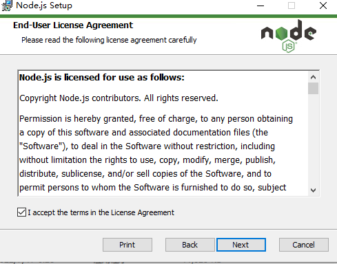
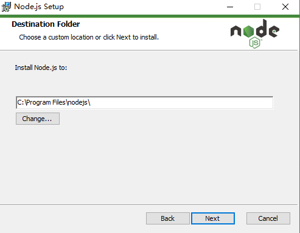
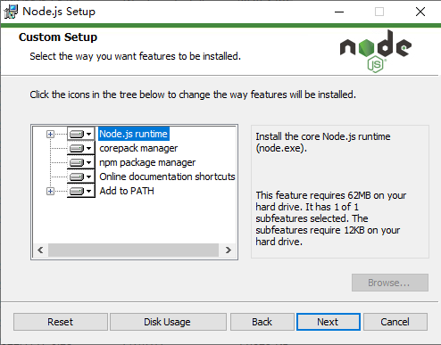
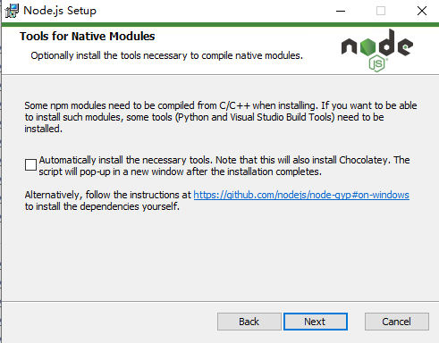
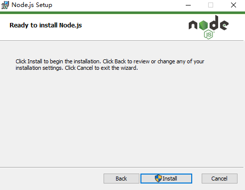

安装完成后在命令框(win+r输入cmd)中输入node -v和npm -v

若如下图显示出版本号即为安装成功

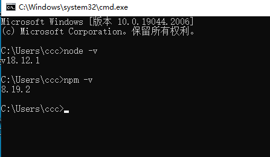

这里先用npm装一个cnpm(这里用的淘宝镜像，可自选其他的)

在命令行中输入：npm install -g cnpm -registry=https://registry.npm.taobao.org

出现下图红线画的一行就成功了

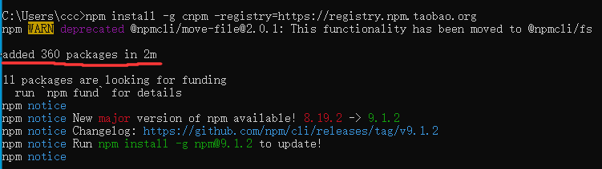

在命令行中输入cnpm -v验证一下

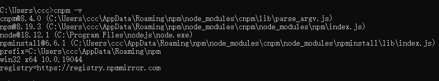

接下来安装docsify

输入命令：cnpm install docsify-cli -g
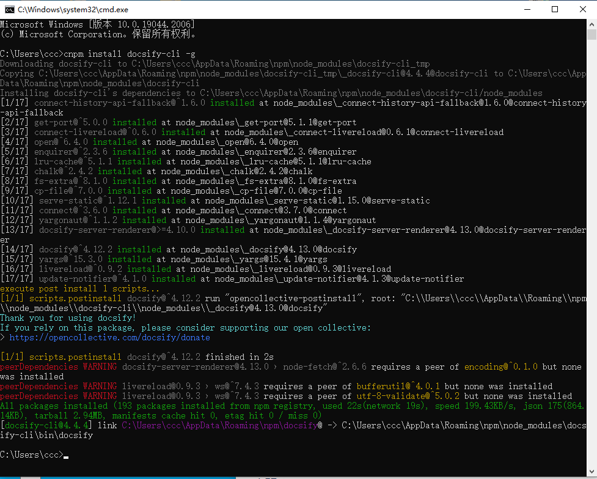

等待安装完成后如下图输入docsify -v验证

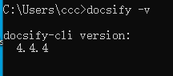

接下来新建一个文件夹，用于保存docsify源文件，新建的文件夹位置随便你
然后如下图打开文件夹是个空的

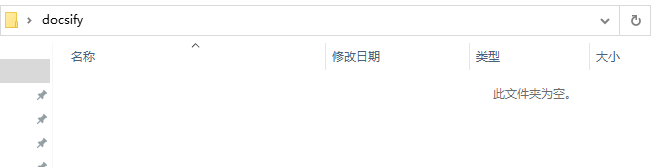

选中上方地址栏，删除原本的内容然后输入cmd后回车

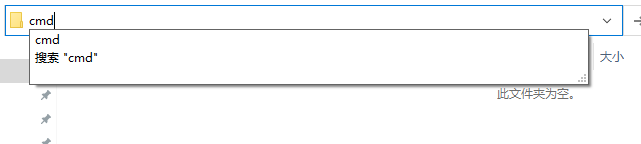

就会进入这个文件夹目录下的终端

在这个终端中如下图输入docsify init进行初始化
出现(y/N)的这一行输入y回车
等待出现succeeded一行
然后输入docsify serve构建

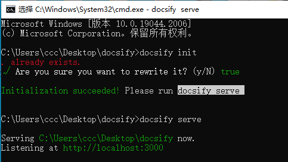

在浏览器中输入http://localhost:3000访问即可

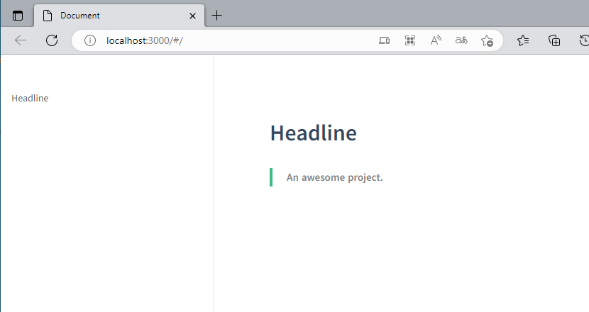

docsify的文件夹中会有下图的三个文件

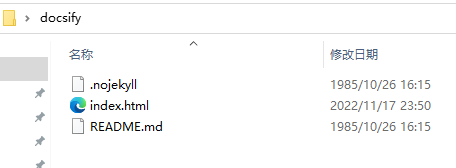

至此，只要不关闭终端，就可以一直个人本地访问

如果需要让别人也能在别的地方通过浏览器访问就查看下面两种方法

## [托管GitHub](qita/docsify1.md)

## [部署至linux服务器](qita/docsify2.md)

> 托管和部署的区别

托管是将你的内容放在别的平台上，我这里是在github的平台，内容存放在github的服务器上，因为它在国外，访问有时候会进不去，另外还有CDN，你新改的内容push上去不会立刻更新

部署你自己的国内服务器，访问绝对很快，而且什么都没有，更新也很快，但缺点也很明显，什么保护都没有，可能会被别人拿来做测试（极小概率），但这个服务器上传没有GitHub直接push舒服
