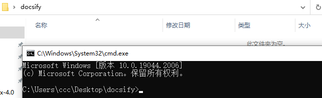

# docsify配置教程

## windows系统安装

> 环境配置

访问node的官网链接：https://nodejs.org/en/

点击下图红箭头所指下载lts版本，注意是lts版本的，不要下最新的（可能不稳定）

下载完成后打开安装，就一直next就行了，该同意的都同意，安装路径随你改不改都行，最后install

安装完成后在命令框(win+r输入cmd)中输入node -v和npm -v

若如下图显示出版本号即为安装成功

这里先用npm装一个cnpm(这里用的淘宝镜像，可自选其他的)
在命令行中输入：npm install -g cnpm -registry=https://registry.npm.taobao.org

出现下图红线画的一行就成功了

在命令行中输入cnpm -v验证一下

接下来安装docsify

输入命令：cnpm install docsify-cli -g

等待安装完成后如下图输入docsify -v验证

接下来新建一个文件夹，用于保存docsify源文件，新建的文件夹位置随便你
然后如下图打开文件夹是个空的

选中上方地址栏，删除原本的内容然后输入cmd后回车

就会进入这个文件夹目录下的终端

在这个终端中如下图输入docsify init进行初始化
出现(y/N)的这一行输入y回车
等待出现succeeded一行
然后输入docsify serve构建

在浏览器中输入http://localhost:3000访问即可

docsify的文件夹中会有下图的三个文件

至此，只要不关闭终端，就可以一直个人本地访问

如果需要让别人也能在别的地方通过浏览器访问就查看下面两种方法

## [托管GitHub](docsify1.md)

## [linux服务器](docsify2.md)
