# docsify托管到GitHub

这里使用的是GitHub desktop进行操作，需要去github创建一个账号并下载应用程序

github官网：https://github.com/

在软件中选择file->new repository（或按ctrl+n）新建

如下图添加一个新库

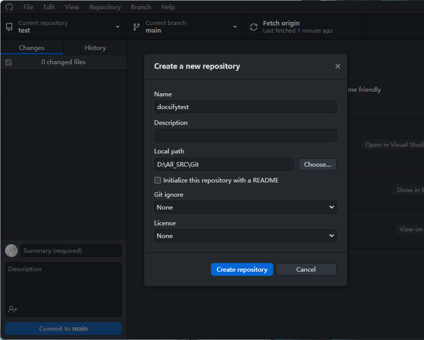

将之前初始化生成的三个文件拖进去

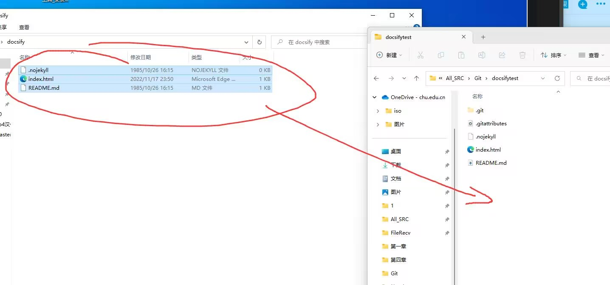

按下图在github desktop中操作

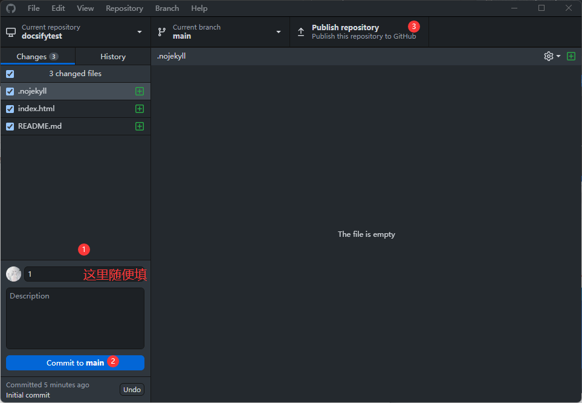

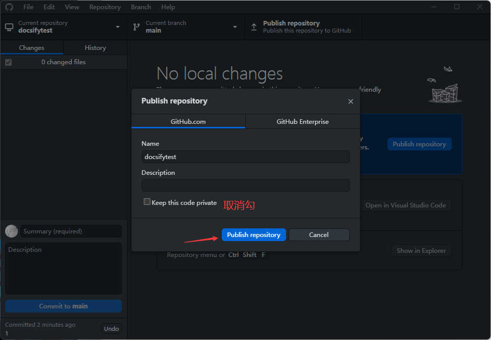

然后登录你的网页版GitHub，打开刚刚上传的库，按红箭头所指操作

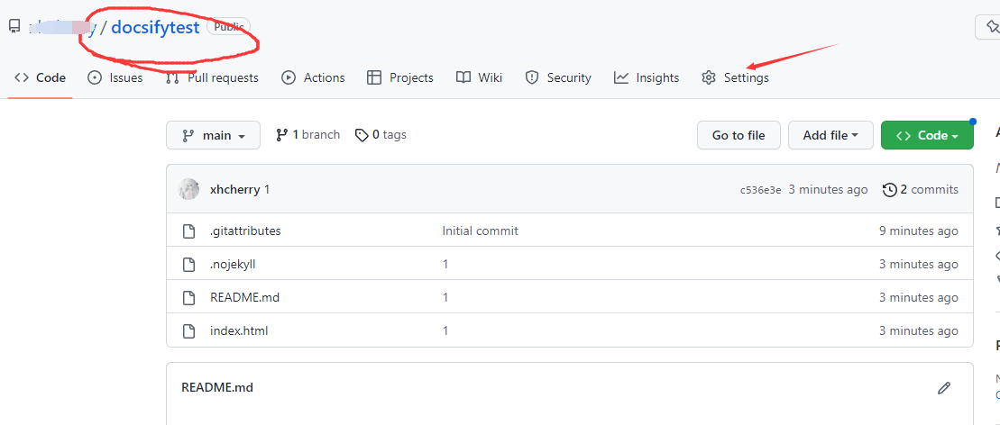
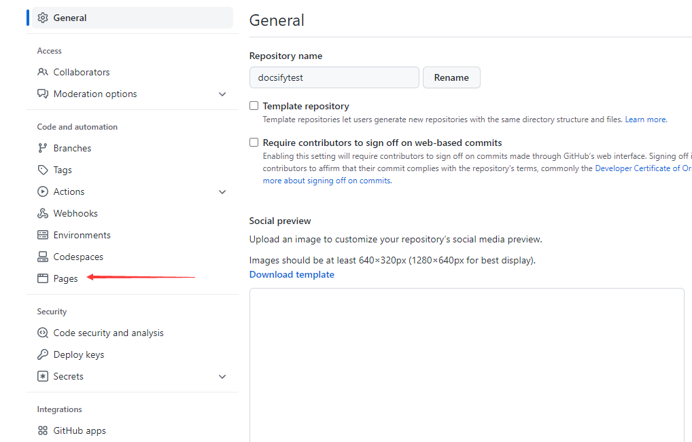

> 第三方域名如下操作，如果你没有域名就看下方的"无自用域名"

下图中红圈的内容是记录值

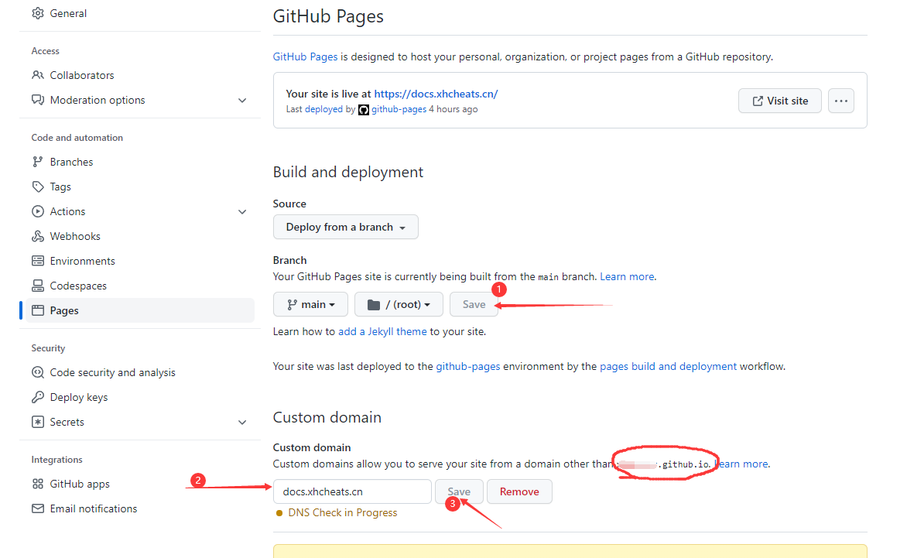

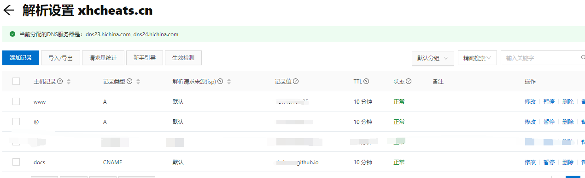

在你的域名解析设置中添加一条记录，如下图所示，记录值就是之前红圈里的

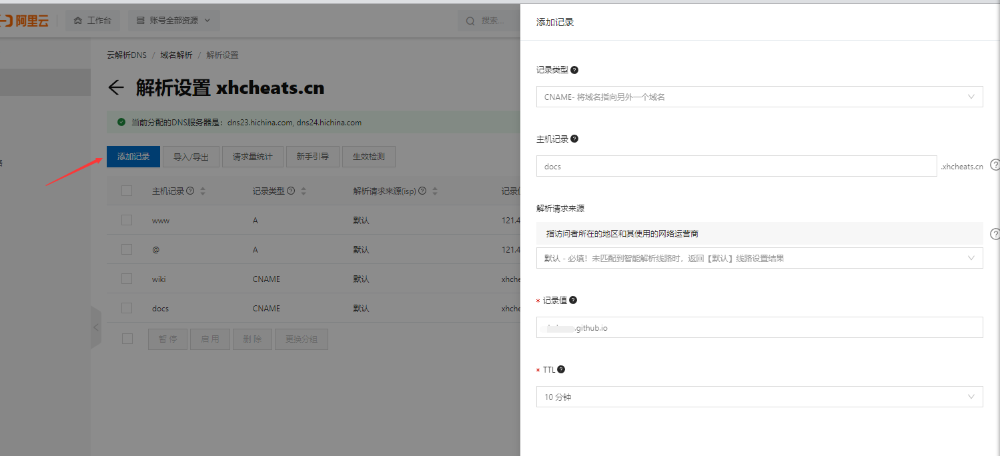

> 无自用域名

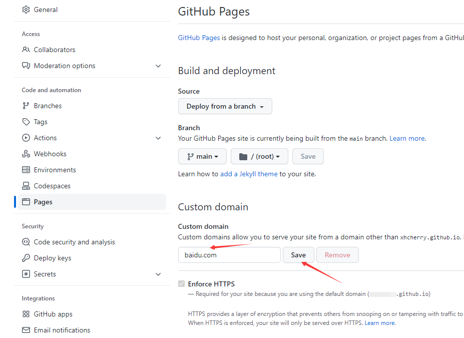

在填入上方内容后会报错，但会在pages页面最上面显示出如下图内容，所指链接就是公开访问链接

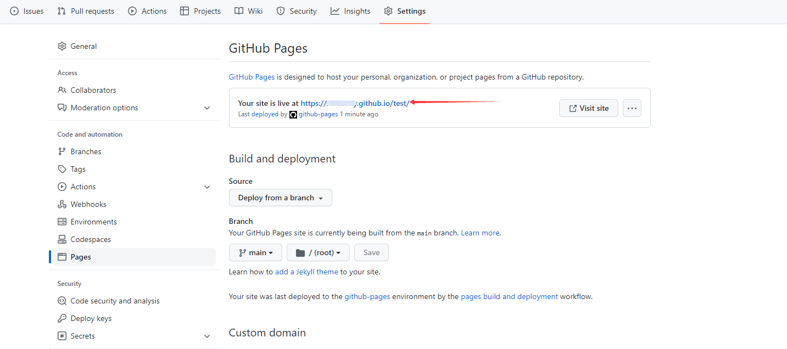
