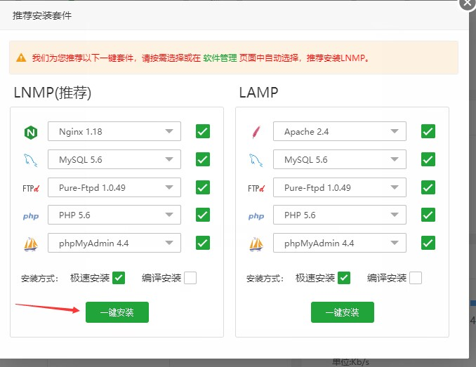

# docsify部署到服务器

这里用的是阿里云的服务器，打开购买的服务器
我这里使用的centos和宝塔
在阿里云控制台打开服务器

在左边栏选择应用详情（如下图）

先点开右边的远程连接（如下图）
将上图中的三个红箭头所指内容复制到下图打开的终端中

每复制一个就回车运行一次

复制上图中的外网面板地址到浏览器最上方的地址栏
进入后如下图
输入终端中的username和password登录

下图看完后同意，进入面板

进入后点lnmp的一键安装

如下图就是完成了

如下图输入你的宝塔账户，如果没有就注册一个

进入面板后点击左边的网站如下图

添加你购买的域名，其他默认

在这个网站后面添加ssl证书（需要去阿里云控制台获取）

在其他证书中添加你的证书点击保存后再打开强制https保存后关闭

现在进入你的域名解析控制台，按下图所指操作

完成后会在解析设置中看见如下图的两条记录

访问你的域名即可看见你的站点（解析要时间可能要等几分钟）

现在再返回你的宝塔面板，点开刚刚在网站中添加的站点（下图红箭头）

点开后如下图点击配置文件

在配置文件中找到图中红圈的内容并将其删除

删完后如下图

再在网站栏目里面点击网址根目录

点击上传（我这一面是之前上传过的，东西才这么多，不用理会）

如下图，将之前初始化的docsify拖进去（如果是第一次，就只有三个文件）

刷新你的域名网站就会如下图（这是修改过的）

如果你需要修改自己的内容，就在本地编写index.html和新建各种md文件（也可以通过远程软件在本地远程连接服务器，就不用手动上传了）

你需要在网上百度一些前端的知识和markdown的知识

或者直接百度关于docsify的相关内容

这是docsify官方文档：https://docsify.js.org/#/

注意：不需要去从头学习这些知识，只需要百度你需要的内容和代码即可