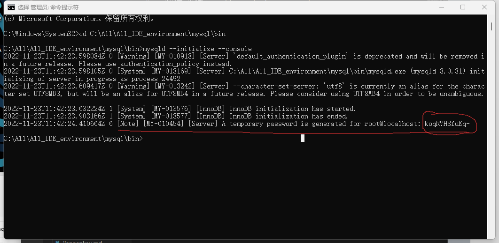

# idea链接mysql配置

https://dev.mysql.com/downloads/mysql/


然后等待下载完成，下载的是zip压缩包


将其完全解压出来（可以解压到别的地方）

并打开解压后的文件夹


打开bin目录，复制并目录的路径名


然后打开环境变量，在系统变量中双击path


点击新建


将刚复制的路径粘贴进去然后确定


在mysql的根目录中新建用于初始化的my.ini文件


将下面代码段复制进去(mysql的安装目录改成自己的，数据存放目录也要改)

```
[mysqld]
# 设置3306端口
port=3306
# 设置mysql的安装目录
basedir=E:\\software\\mysql\\mysql-8.0.11-winx64   # 切记此处一定要用双斜杠\\，单斜杠我这里会出错，不过看别人的教程，有的是单斜杠。自己尝试吧
# 设置mysql数据库的数据的存放目录
datadir=E:\\software\\mysql\\mysql-8.0.11-winx64\\Data   # 此处同上
# 允许最大连接数
max_connections=200
# 允许连接失败的次数。这是为了防止有人从该主机试图攻击数据库系统
max_connect_errors=10
# 服务端使用的字符集默认为UTF8
character-set-server=utf8
# 创建新表时将使用的默认存储引擎
default-storage-engine=INNODB
# 默认使用“mysql_native_password”插件认证
default_authentication_plugin=mysql_native_password
[mysql]
# 设置mysql客户端默认字符集
default-character-set=utf8
[client]
# 设置mysql客户端连接服务端时默认使用的端口
port=3306
default-character-set=utf8
```

在搜索框中输入cmd并选择管理员身份运行


先通过cd命令打开mysql根目录下的bin文件夹


在此目录中输入mysqld --initialize --console


等待运行完成后出现下图，红圈内的一串就是初始密码（无空格），在没有更新密码前，保存好这个密码，登录要用



如下图继续输入mysqld --install [服务名]
后面的服务名可以不写，默认的名字为 mysql。如果你需要安装多个MySQL服务，就可以在[服务名]处起名字


然后通过命令net start mysql启动MySQL服务

注：net stop mysql停止服务;sc delete MySQL/mysqld -remove卸载MySQL服务


然后输入mysql -u root -p
会提示输入密码，这个密码就是之前生成的密码，输入进去

然后输入修改密码的命令
```ALTER USER 'root'@'localhost' IDENTIFIED BY '新密码';```
（新密码处填修改后的密码），打码的地方是输错了的，不用管


mysql服务安装完成了，接下来打开idea

在右边栏选数据库，点开加号，选择数据源，在数据源中找到mysql


在下图中下载驱动文件


下载完成后在用户名处输入root
密码是之前修改后的密码
输入好后测试链接，如下图即为成功，确定即可

