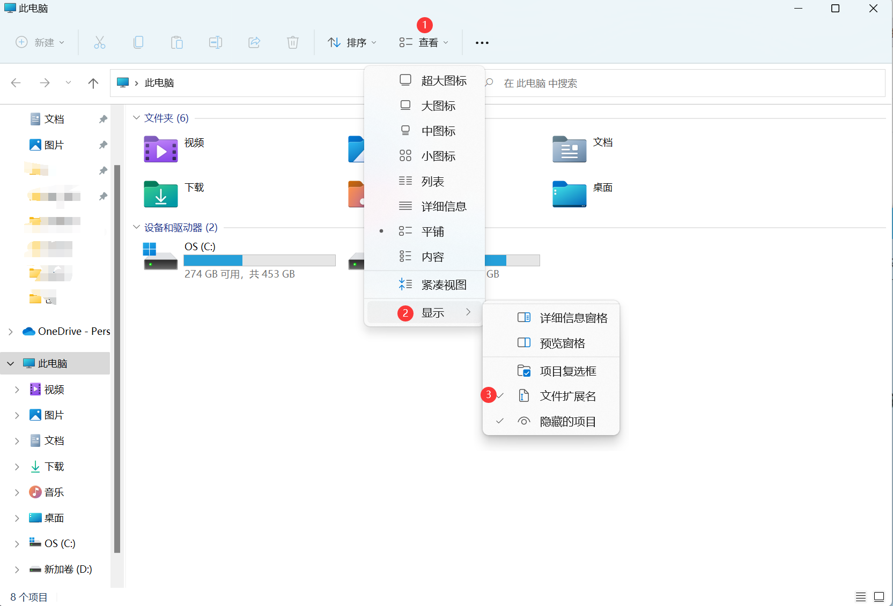
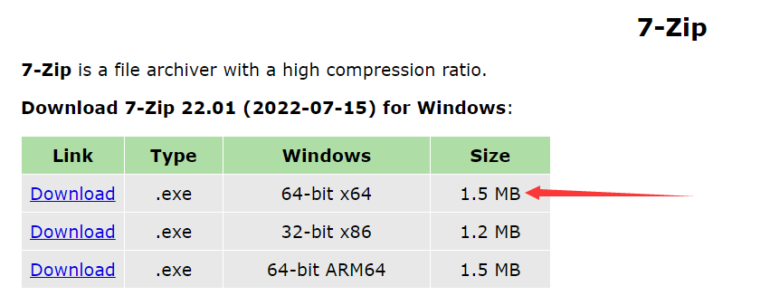

# 下载辅助压缩包解压教程

先看此图以显示文件拓展名

如上图，先打开此电脑，选择查看，选择显示，将文件拓展名勾上

下面是你下载的不同文件后缀的解压方法

## 1.ZIP

这种的最简单，只需要右键你刚刚下好的压缩包后选择全部解压缩即可

## 2.RAR/7Z等

这一类的压缩包右键后并没有全部解压缩的选项，你需要下载安装一个解压软件

这里推荐7z，7z官网：[https://www.7-zip.org/](https://www.7-zip.org/)

在官网中点击下图红箭头指的版本就行

将其安装完成后，再右键需要解压的压缩包选择7-zip，然后选择提取文件

此时会转到一个对话框，只需要点击确定即可，无需进行其他操作

解压完成后会出现一个和压缩包一样名字的文件夹，打开文件夹，再进行相关的操作

## 3.你电脑已经安装了某款解压软件

双击你下载的压缩包，然后选择菜单栏中的解压到
