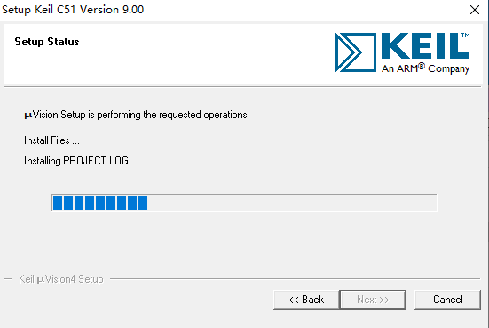
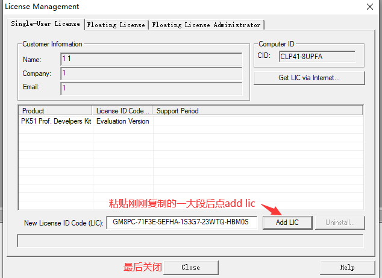

# windows安装keil

.png>)

.png>)

下图不建议用中文路径

.png>)

.png>)

.png>)

.png>)

<mark style="color:red;">**如果看不见上图红圈的文件就先关闭电脑杀毒，详见下链接**</mark>


[windows-guan-bi-sha-du-bao-hu.md](windows-guan-bi-sha-du-bao-hu.md)


<mark style="color:red;">**关闭杀毒后重新下载文件**</mark>

打开keil\_lic后先放在那

再在桌面打开keil uvision4按下图操作

.png>)

.png>)

enjoy it！！！
