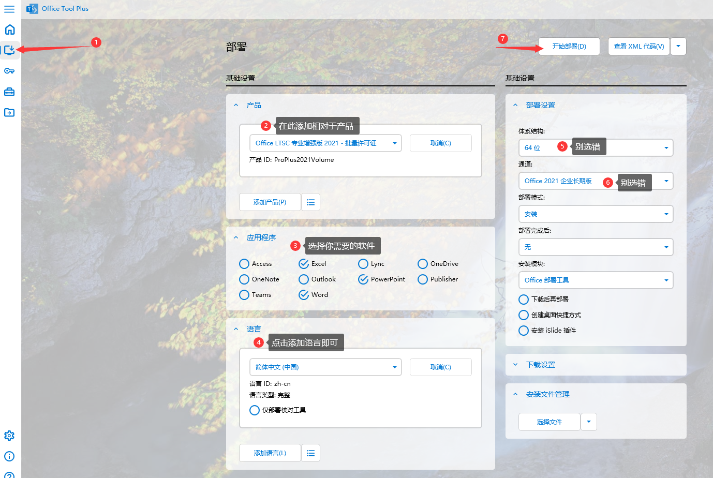

# Microsoft office激活教程

访问此链接下载office tool plus：[https://otp.landian.vip/redirect/download.php?type=runtime\&site=sdumirror](https://otp.landian.vip/redirect/download.php?type=runtime\&site=sdumirror)

下载完成后将其全部解压出来

&#x20;       如果你不会解压看这解压教程：


[jieya.md](../wiki-zhu-ye/jieya.md)


解压完成后打开office tool plus

.png>)

进入主页后选择左边栏的部署，按下图所指按步骤操作

<figure><figcaption></figcaption></figure>

点击开始部署后就等待安装完成

安装完成后

如下图点击左边栏的激活并且按照步骤和要求填写内容

<figure><figcaption></figcaption></figure>

最后点击第六步激活等待显示激活完成即可

如果激活失败就按下图方法先清除许可证

.png>)
