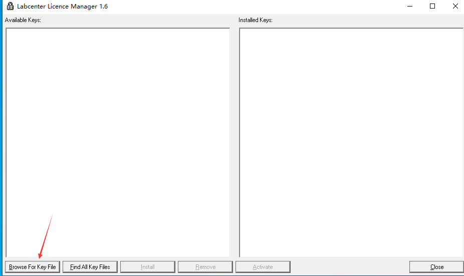
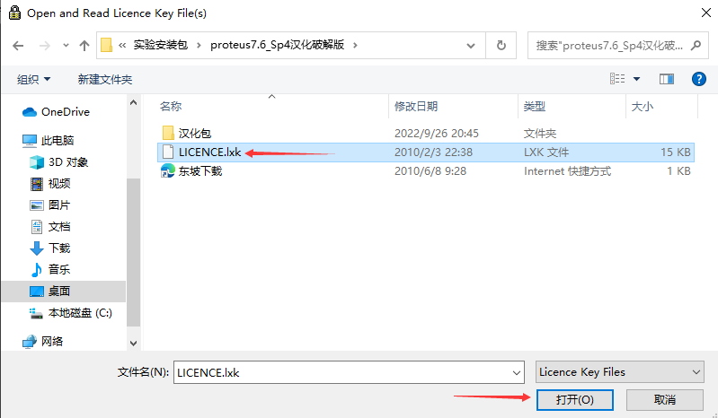
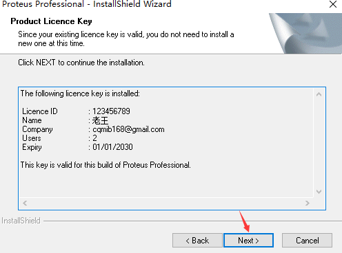
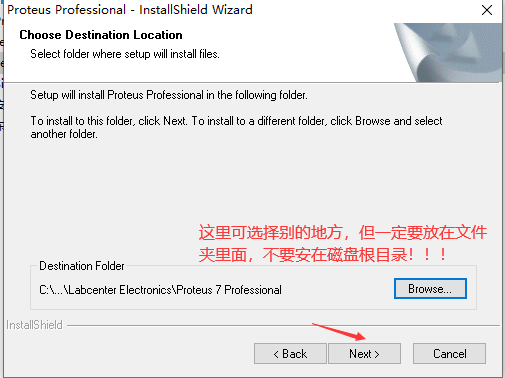
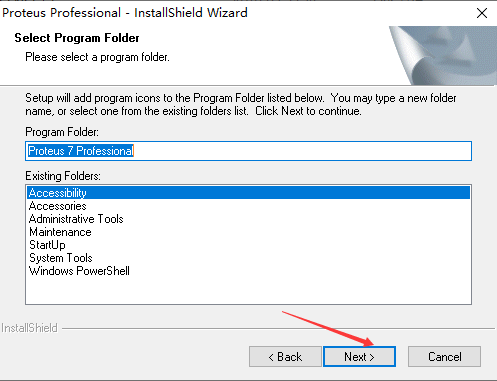
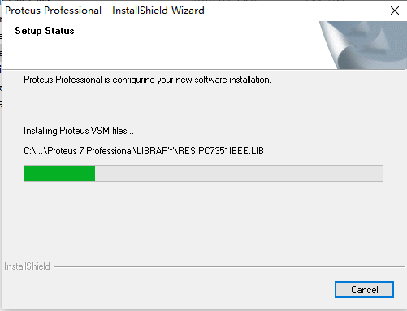
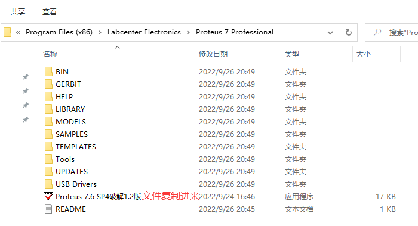
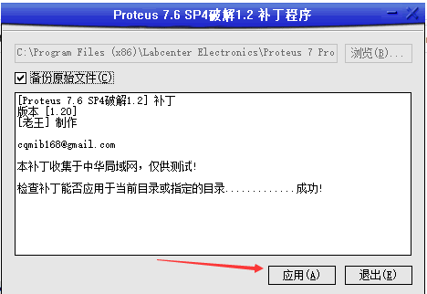
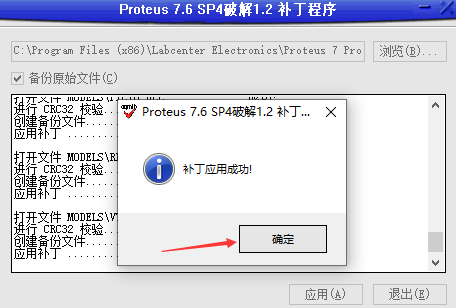
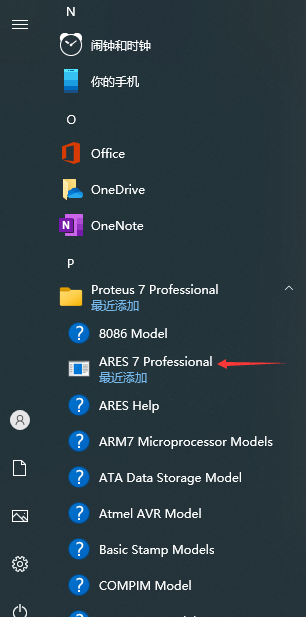

# windows安装proteus7.6\_Sp4

K@NA\`14L.png)

<figure><figcaption></figcaption></figure>

<figure><figcaption></figcaption></figure>

<figure><figcaption></figcaption></figure>

<figure><figcaption></figcaption></figure>

<figure><figcaption></figcaption></figure>

<figure><figcaption></figcaption></figure>

<figure><figcaption></figcaption></figure>

下图不建议用中文路径

<figure><figcaption></figcaption></figure>

<figure><figcaption></figcaption></figure>

<figure><figcaption></figcaption></figure>

<figure><figcaption></figcaption></figure>

<figure><figcaption></figcaption></figure>

<mark style="color:red;">**打开刚刚的安装路径（默认C:\Program Files (x86)\Labcenter Electronics\Proteus 7 Professional）**</mark>

<mark style="color:red;">**如果你下载的包里面没有Proteus 7.6 SP4破解1.2版这个文件**</mark>

<mark style="color:red;">**就参考下面链接后重新下载文件**</mark>


[windows-guan-bi-sha-du-bao-hu.md](windows-guan-bi-sha-du-bao-hu.md)


<figure><figcaption></figcaption></figure>

<figure><figcaption></figcaption></figure>

<figure><figcaption></figcaption></figure>

<figure><figcaption></figcaption></figure>

<figure><figcaption></figcaption></figure>

<figure><figcaption></figcaption></figure>

至此安装完成

在开始菜单的所有应用中找到它的文件夹，ares 7打开即可

<figure><figcaption></figcaption></figure>

如上图，enjoy it！
