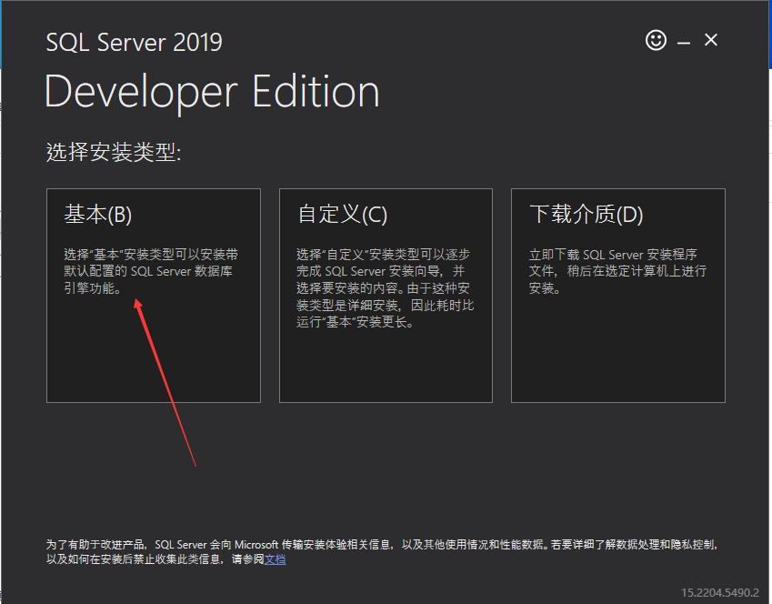
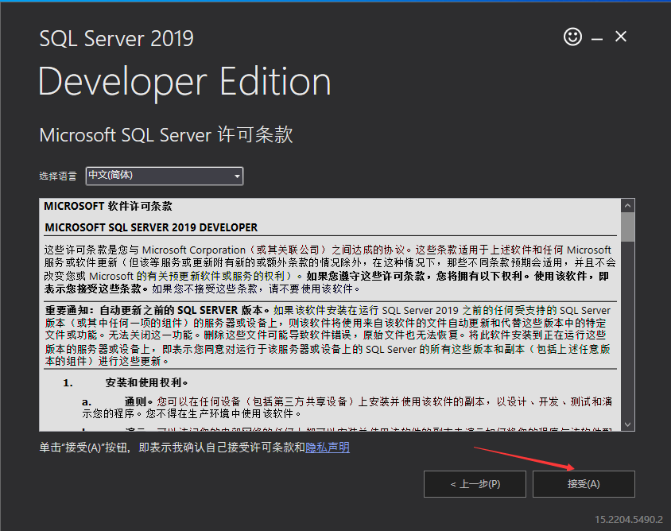
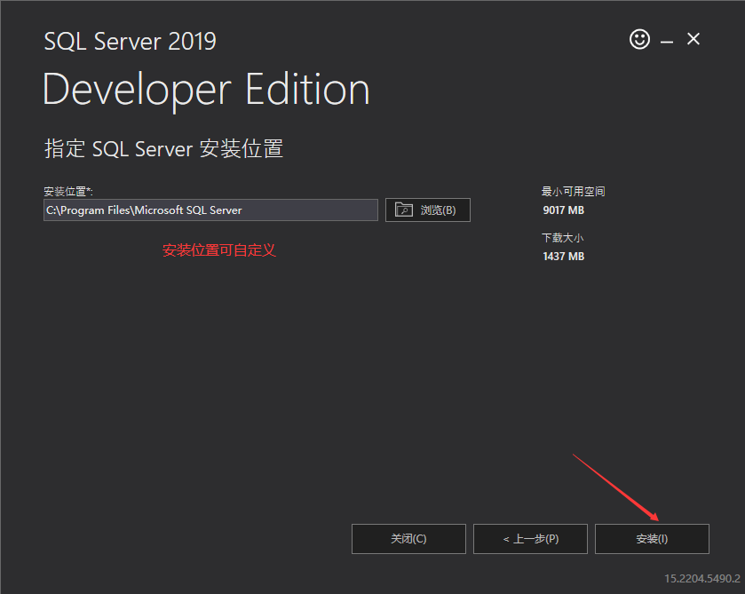
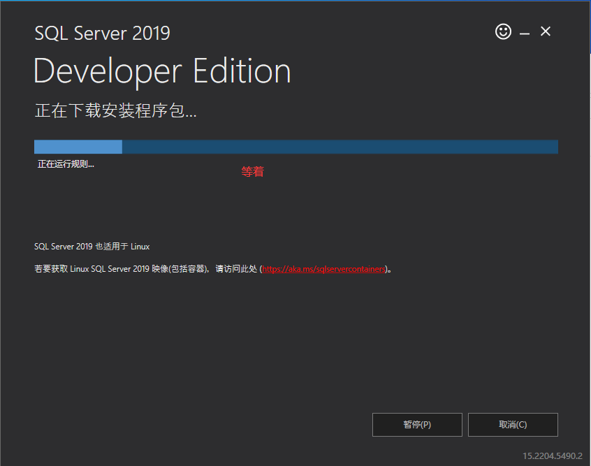
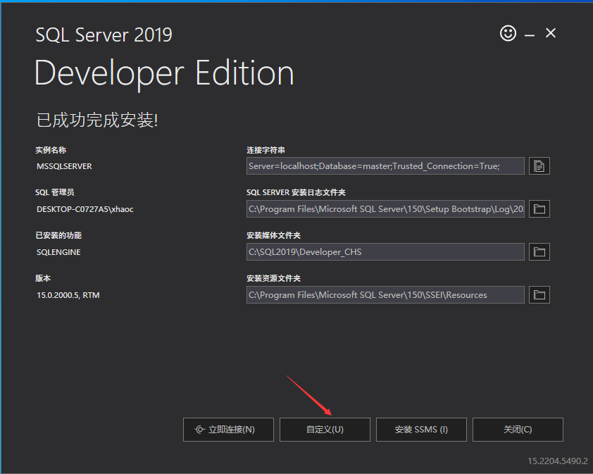
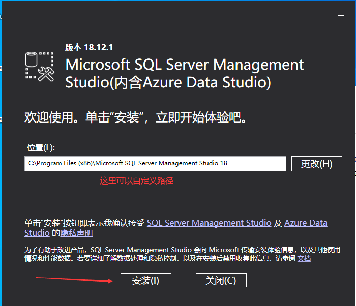
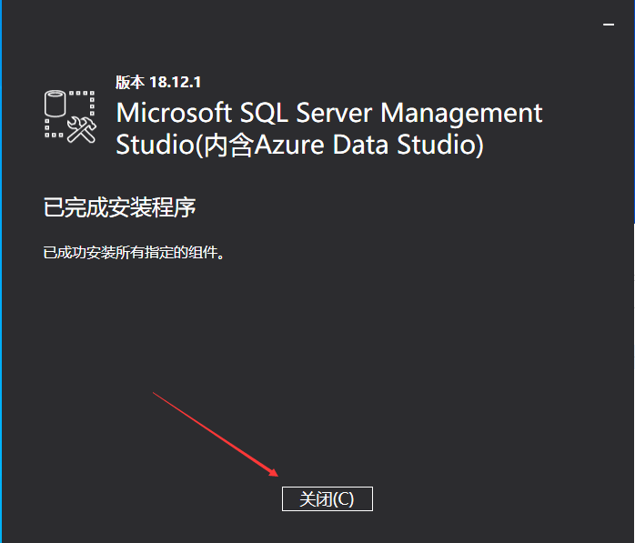
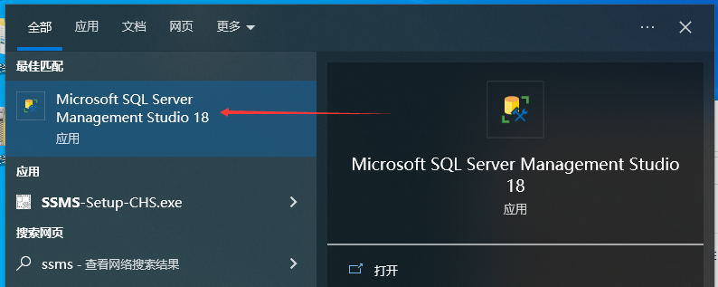
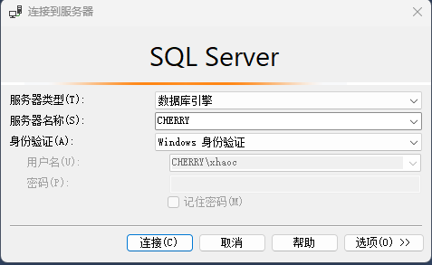

# windows安装SQL2019

访问此链接自动开始下载[https://go.microsoft.com/fwlink/?linkid=866662](https://go.microsoft.com/fwlink/?linkid=866662)

下载完成后打开

下图不建议用中文路径

**如下图直接点关闭，我画错了，不要点自定义**

访问此链接下载[ssms](https://aka.ms/ssmsfullsetup)

在电脑下方搜索框搜ssms并打开

enjoy it！
