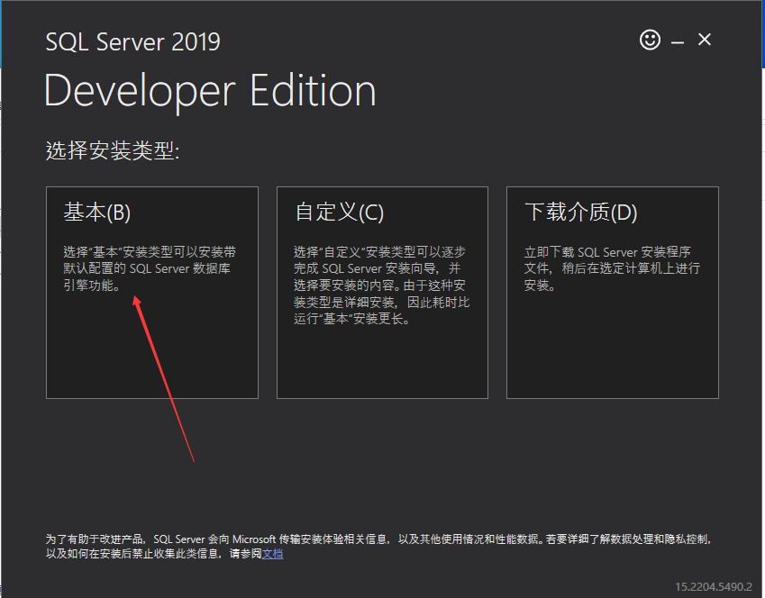
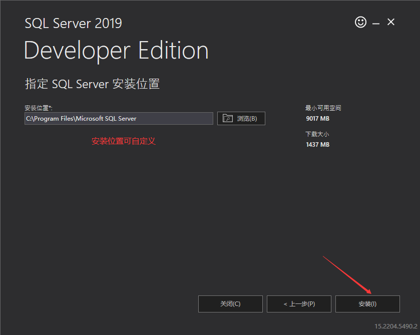
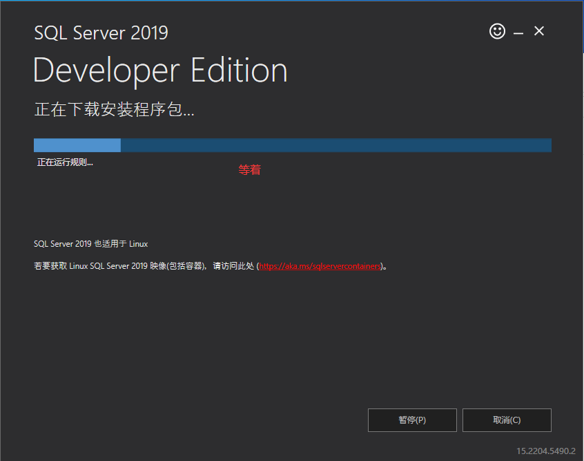
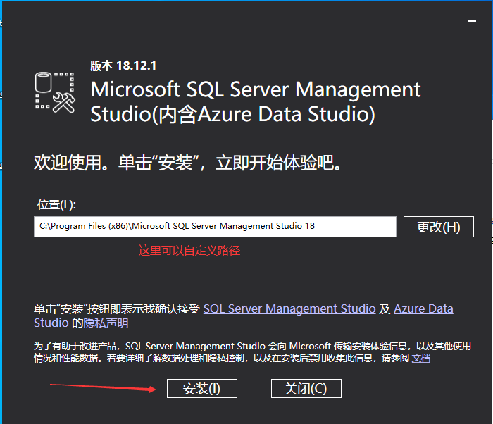

# windows安装SQL2019

访问此链接自动开始下载[https://go.microsoft.com/fwlink/?linkid=866662](https://go.microsoft.com/fwlink/?linkid=866662)

下载完成后打开

<figure><figcaption></figcaption></figure>

<figure><figcaption></figcaption></figure>

下图不建议用中文路径

<figure><figcaption></figcaption></figure>

<figure><figcaption></figcaption></figure>

**如下图直接点关闭，我画错了，不要点自定义**

<figure><figcaption></figcaption></figure>

**访问此链接下载ssms**[**https://aka.ms/ssmsfullsetup**](https://aka.ms/ssmsfullsetup)****

{N6}\`$7.png)

在电脑下方搜索框搜ssms并打开

.png>)

enjoy it！
